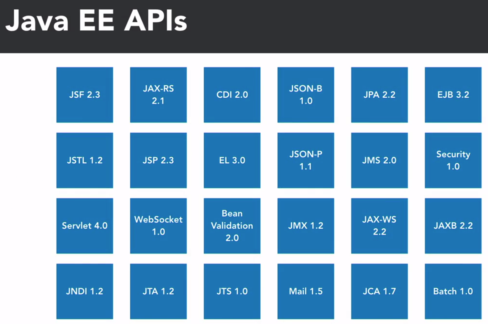
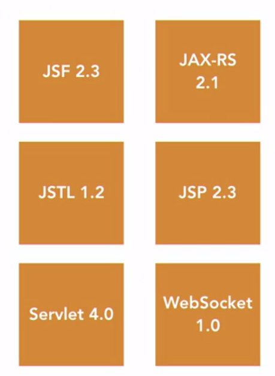

     </img> 
    
<!-- Encabezado -->
### Java EE 8 | Escencial Training
#### OKR Personal Q4 2022
#### Autor 

| Nombre | Identidad | Correo |
|:-------------:| :-----:|:-----:|
| Edgar Josué Benedetto Godoy | `0801-1997-23600` | [Gmail](mailto:edgar.benedetto@baccredomatic.hn) |

_____
_____

## 1. Introducción
#### 1.1 Vista previa

#### Java EE APIs para desarrollo web

* JSF 2.3 (Java Server Faces)
  * Para crear interfaces de usuario
* JSTL 1.2 (Java Server Pages Standard Tag Library)
  * Para crear páginas web dinámicas
* Serverlet 4.0
  * Para crear páginas web dinámicas
* JAX-RS 2.1 (Java API for RESTful Web Services)
  * Para crear servicios web RESTfulq
* JSP 2.3 (Java Server Pages)
  * Para crear páginas web dinámicas
* WebSocket 1.1
  * Para crear aplicaciones web en tiempo real
* CDI 2.0 (Contexts and Dependency Injection)
  * Para inyección de dependencias
* EL 3.0 (Expression Language)
  * Para evaluar expresiones
* Bean Validation 2.0
  * Para validación de datos
* Json-B (JSON Binding)
* Json-P (JSON Processing)
* JPA 2.2 (Java Persistence API)
  * Para información persistente para bases de datos relacionales
* JMS 2.0 (Java Message Service)
  * Para enviar mensajes entre aplicaciones
* EJB 3.2 (Enterprise Java Beans)
  * Para crear componentes de negocio
* Security 1.0
  * Para autenticación y autorización
______

#### 1.2 Nuevo en Java EE 8
Los menores avances se ven en las siguientes APIs:
1. **JSF 2.3**
   1. Server push (enviar datos al cliente sin solicitarlo)
   2. Errores menores de direccionamiento
2. **JAX-RS 2.1**
   1. API de cliente reactiva, CompletionStage que orquesta llamados a multiples servicios y Reactive Streams
   2. Server Sent Events (SSE) para enviar eventos de forma asíncrona
3. **JSON-P 1.1**
   1. JSON Pointer para acceder a partes de un JSON, provee una forma de acceder a un JSON sin tener que parsearlo basado en una expresión que sirve para identificar valores dentro de un JSON
   2. JSON Patch, JSON Merge Patch para modificar/actualizar un JSON usando expresiones de rutas usando un API fluida. Patch causa la operación y Merge genera el dif

Los mayores avances se ven en las siguientes APIs:
1. **Servlet 4.0**
   1. Inclusión de HTTP/2
   2. PushBuilder como archivos JSS y CSS, Runtime Discovery of Servlet Mapping es un HTTP Servlet que mapea objetos que permite tener visibilidad del Servlet que se invoca
2. **CDI 2.0**
   1. Especificaciones divididas para sopotar diferentes Java SE
   2. Observadores de prioridad que controla el orden de los eventos que recibe
   3. Los eventos cambian para permitir los eventos asincrónicos
3. **Bean Validation 2.0**
   1. Restricciones integradas adicionales incluyendo fechas, numeros y cadenas de texto
   2. Validación de grupos o colección de tipos

Algunas de las mejoras generales que se pueden destacar son:

Java EE 8 es la primera versión de Java EE que se publica bajo la licencia de código abierto Eclipse Public License 2.0. Introduce JSON-B y JSON-P para reemplazar a JAXB
* **Json-B**
  * Serialización y deserialización de objetos Java a JSON y viceversa
  * Serialización y deserialización personalizada
* **Security 1.0**
  * Introduce el HttpAuthenticationMechanism API para crear mecanismos de autenticación personalizados, IdentityStore API para crear proveedores de identidad personalizados y el IdentityStoreHandler API para crear manejadores de identidad personalizados, SecurityContext API para crear contextos de seguridad personalizados y el SecurityContextAssociation API para crear asociaciones de contexto de seguridad personalizados
______

#### 1.3 Java EE 8 Instalación del server

[Descargar Version 17.0.1 WildFly](https://www.wildfly.org/downloads/)

______

#### 1.4 JBoss instalación y herramientas
JBoss AS es el primer servidor de aplicaciones de código abierto, preparado para la producción y certificado J2EE 1.4, disponible en el mercado, ofreciendo una plataforma de alto rendimiento para aplicaciones de e-business.

El servidor de aplicaciones es el componente de tiempo de ejecución principal en todas las configuraciones y donde una aplicación se ejecuta realmente. El servidor de aplicaciones colabora con el servidor web para ofrecer una respuesta dinámica y personalizada a una solicitud de cliente.

**Instalar JBoss**
1. Dentro de Eclips ir a ***Help*** luego a ***Eclipse Marketplace***
2. En el buscador escribir ***JBoss***
3. Instalar ***JBoss***

**Detener JBoss**
1. Lance la CLI administrativa. $ EAP_HOME/bin/jboss-cli.sh --connect.
2. Ejecute el comando shutdown . shutdown.
______

#### 1.5 Integración de WildFly con el IDE Eclipse
1. Crear un nuevo server
2. Seleccionar JBoss y luego WildFly 17
3. En el runtime seleccionar JRE y en Configuration file seleccionar ***standalone-full.xml*** de la carpeta standalone del WildFly