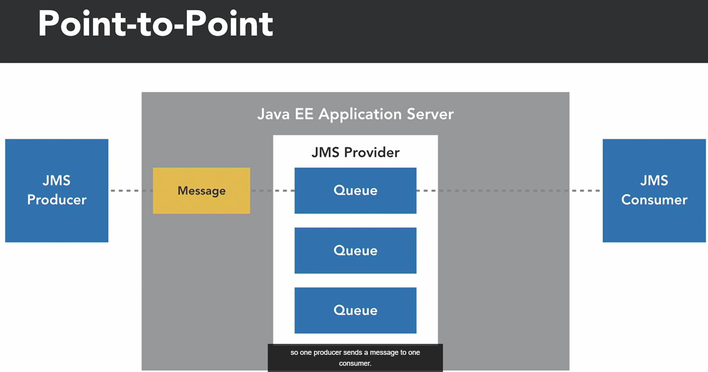
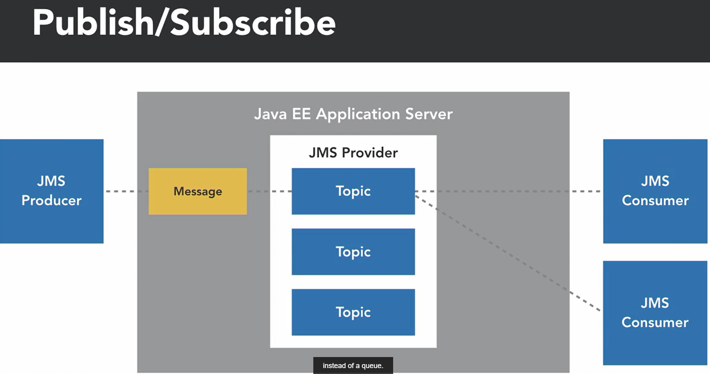
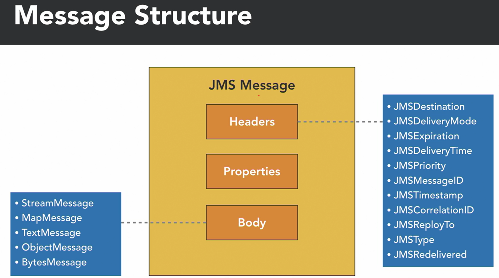

<div align="center">
     </img> 
    
<!-- Encabezado -->
### Java EE 8 | Escencial Training
#### OKR Personal Q4 2022
#### Autor 


| Nombre | Identidad | Correo |
|:-------------:| :-----:|:-----:|
| Edgar Josué Benedetto Godoy | `0801-1997-23600` | [Gmail](mailto:edgar.benedetto@baccredomatic.hn) |

</div>

_____
_____
## 10. Java Messaging Service JMS
#### 10.1 Vista previa

Java Messaging Service, o JMS, ha sido parte de Java EE desde la versión 1.2. La introducción de la versión 2.0 de JMS simplificó la API de JMS, lo que facilitó mucho el trabajo con la tecnología de mensajería. **La mensajería es un patrón de integración común utilizado por las aplicaciones Java** y existen muchas implementaciones de servicios de mensajería de nivel medio.

La API de **JMS proporciona un enfoque y esquemas comunes para las aplicaciones Java que utilizan mensajería**, define **funciones para los servicios de mensajería**, conocidos como **proveedores de JMS**. Se pueden aplicar los conceptos de mensajería en JMS para usar múltiples proveedores de JMS sin un conocimiento específico de cada uno de ellos. 

Dentro de JMS encontraremos **soporte para dos estilos de mensajería**
1. **Punto a punto** 
	Comienza con el productor JMS escribiendo un mensaje en una cola. Luego, el mensaje es consumido fuera de la cola por un solo consumidor JMS, por lo que un productor envía un mensaje a un consumidor.

	

2. **Suscripción de publicación** 
	El estilo de mensajería de publicación/suscripción utiliza un tema en lugar de una cola. El tema permite que los mensajes se distribuyan a varios consumidores de JMS en lugar de a un solo consumidor.

	

**La estructura de un mensaje JMS** contiene **tres secciones**. 

1. Los encabezados 
	Los encabezados JMS se corrigen en todos los mensajes JMS. Estos encabezados incluyen el destino, el método de entrega, el ID del mensaje, el tiempo de entrega y otra información
2. Las propiedades 
	La sección de propiedades del mensaje permite a los productores o al proveedor de JMS agregar encabezados opcionales al mensaje que pueden leer los consumidores. 
3. El cuerpo  
	El cuerpo de un mensaje JMS puede ser uno de cinco tipos, lo que brinda soporte para secuencias, mapas, texto, objetos y bytes. 

Las API de JMS que se utilizan para enviar y recibir mensajes. Dentro de la API de JMS, utilizamos principalmente cuatro interfaces para enviar y recibir mensajes. 

| API | Description |
|:-------------:| :-----:|
| ConnectionFactory | Un cliente JMS la puede utilizar para obtener una conexión con el proveedor JMS 
| JMSContext | Combina una conexión y una sesión que se utilizan para crear el productor y el consumidor, es un contenedor administrado dentro de una aplicación Java EE |
| JMSProducer | Se utiliza para enviar mensajes a un destino |
| JMSConsumer | Leer mensajes de un tema o una cola |


_____
#### 10.2 Configuración de la cola

Para poder trabajar con JMS se deben crear colas en el servidor:
1. Navegar hasta la carpeta del servidor que se use en la aplicación Java
2. Hacer clic con el botón derecho en la carpeta bin y abrir PowerShell. 
3. Usar el archivo jboss-cli.bat y proporcionar el argumento ```.\jboss-cli.bat --connect```, continuará y nos conectará al servidor Wildfly. 
4. Activar una cola dentro de uno de los subsistemas donde la cola se agrega en jms-queue y luego necesitamos agregar para agregar una entrada y luego especificamos un nombre JNDI con el comando ```/subsystem=messaging-activemq/server=default/jms-queue=HsportsQueue:add(entries=[java:/jms/queue/HsportsQueue])  

Wildfly usa MQ Active, que es un proveedor de colas de mensajes de código abierto y JMS podrá integrarse tanto con este como con otros proveedores de mensajería.

_____
#### 10.3 JMSProducers

Dentro de la API de JMS, la **interfaz del productor se utiliza para enviar mensajes a una cola o tema de JMS**. Desde **JMS 2.0**, el enfoque para **crear un productor y enviar un mensaje** se ha simplificado significativamente **mediante anotaciones**. Vamos a ver. Seguiremos adelante y crearemos una nueva clase dentro de nuestro proyecto JAX-RS en el paquete calm.LinkedIn. Así que solo usa el diálogo para crear una nueva clase. Y vamos a llamar a esta clase servicio JMS. Seguiremos adelante y lo lograremos. Y luego vamos a agregar la anotación en el ámbito de la aplicación a esta clase para que sea un bean en el ámbito de la aplicación. Así que podemos seguir adelante, importar esa anotación. Y luego lo que vamos a hacer es agregar un método a esta clase que simplemente se llamará enviar. Y ese método tomará una cadena como mensaje. Desde aquí, vamos a inyectar la cola real a la que nos gustaría enviar el mensaje. Para hacer eso, podemos usar la anotación de recursos. Y vamos a crear un campo de tipo Queue y lo llamaremos simplemente hsports Queue. Ahora, cuando usamos la anotación de recursos, podemos proporcionar el nombre JNDI para la cola. Así que sigamos adelante y especifiquemos eso usando el elemento de nombre asignado en esa anotación. Y si recuerda cuando creamos la cola, definimos este nombre JNDI y era /JMS/queue/HsportsQueue. Bien, ahora otra cosa que haremos aquí es inyectar el contexto JMS. Así que vamos a usar la anotación de inyección y luego vamos a crear un nuevo campo de tipo contexto JMS. Esta es una combinación de la sesión y la conexión. Y luego vamos a agregar también la anotación de la fábrica de conexiones JMS. Y esto nos va a permitir engancharnos al contexto JMS. También tiene un nombre JNDI que especificaremos y es /connectionfactory. Bien, todo esto existe dentro de nuestro servidor de aplicaciones Java EE wildFly. Ahora que hemos configurado los diferentes campos que necesitamos, tenemos nuestro método de envío. Avancemos y escribamos un código para enviar un mensaje a nuestra cola de nuestro productor. Así que simplemente crearemos un bloque try catch, para detectar cualquier excepción que pueda ocurrir. Y si obtenemos una excepción, imprimiremos el seguimiento de la pila. Y luego dentro de este intento de atrapar, vamos a seguir adelante y hacer un mensaje de texto. Este es el mensaje que JMS va a pasar del productor al consumidor. Y podemos usar el contexto para crear un mensaje de texto. Y ese método para hacer eso se llama crear mensaje de texto bastante obvio. Y luego, dentro de ahí, simplemente pasaremos el mensaje que recibimos como parámetro a nuestro método de envío. Y eso creará nuestro mensaje de texto que usaremos para enviar a nuestro productor. Entonces, para obtener el productor, podemos usar el contexto y hay un método de creación de productor en el contexto. Y ese productor tiene un método de envío y requiere que proporcionemos un destino, en este caso será nuestro hSportsqueue. Y luego tenemos que proporcionar un mensaje. Así que creamos ese mensaje de texto, que será el segundo argumento de ese método. Y luego agregaré una pequeña salida de la consola para que podamos ver que el mensaje realmente se envió. Y solo diremos que el mensaje fue enviado a la cola. Entonces, si echamos un vistazo aquí, estamos recibiendo un error en nuestro método de envío. Y eso es porque importamos la cola incorrecta. Así que voy a seguir adelante y eliminar esa importación. Esta vez tendré cuidado de seleccionar JMS Queue. Y ahora nuestro productor está listo para enviar mensajes a JMS Queue. Entonces, con nuestro productor preparado, necesitamos encontrar una manera de enviar el mensaje. Así que vamos a ir a nuestra clase de punto final de artículo de inventario y recordará que este es el recurso que creamos dentro de JAX-RS. Y podemos inyectar a nuestro productor en esta clase. Así que vamos a crear un nuevo campo de tipo servicio JMS. Y lo llamaremos el servicio JMS. Y podemos seguir importando esos tipos. Y ahora CDI ha inyectado nuestro servicio JMS en este recurso que se creó con JAX-RS. Y podemos usar nuestro servicio JMS y su método de envío para enviar un mensaje. Y en este caso, solo vamos a obtener el nombre del elemento de inventario recién creado. Así que tenemos el elemento del inventario que se está pasando, podemos obtener su nombre y lo enviaremos como un mensaje de texto JMS. Entonces, aquí puede ver que el productor JMS también califica para la inyección de dependencia si lo convertimos en un bean. Muy bien, así concluye nuestra mirada al JMS Producer, seguiremos adelante y crearemos un consumidor que realmente podrá leer este mensaje de la cola que creamos.