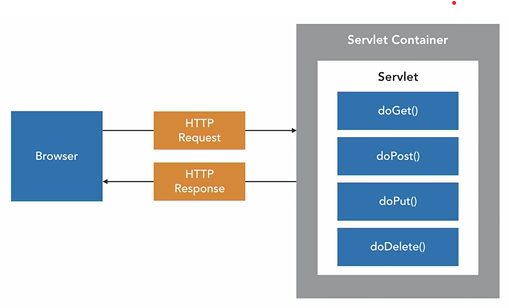
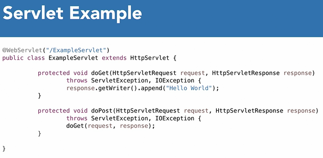
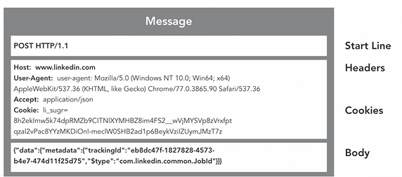

<div align="center">
     </img> 
    
<!-- Encabezado -->
### Java EE 8 | Escencial Training
#### OKR Personal Q4 2022
#### Autor 


| Nombre | Identidad | Correo |
|:-------------:| :-----:|:-----:|
| Edgar Josué Benedetto Godoy | `0801-1997-23600` | [Gmail](mailto:edgar.benedetto@baccredomatic.hn) |

</div>

_____
_____

## 2. Servlet API
#### 2.1 Vista previa



Los servlets pueden dar soporte al contenido de páginas web dinámicas, proporcionar acceso a bases de datos, servir a varios clientes a la vez y filtrar datos. En el servidor de aplicaciones, las discusiones de los servlets se centran en los servlets HTTP, que sirven a clientes basados en web.

Los servlets son programas Java™ que utilizan la interfaz de programación de aplicaciones (API) de servlet Java. Debe empaquetar los servlets en un archivo WAR (archivador de aplicación web) o un módulo web para su despliegue en el servidor de aplicaciones.

Los servlets se ejecutan en un contenedor de servlets, que es un servidor web o de aplicaciones que proporciona servicios de red para recibir solicitudes y enviar respuestas. 

Una vez inicializado, un servlet está disponible para procesar solicitudes, las solicitudes se procesan utilizando un método de interfaz de servlet que corresponde al método HTTP de la solicitud y luego se genera contenido dinámico y se envía al navegador. 

La lógica de servlet maneja una variedad de problemas de aplicaciones, como:
1. Escribir datos en una base de datos
2. Generar contenido dinámico, como HTML, para volver al navegador. 

La interfaz de servlet contiene métodos que implementamos para procesar solicitudes con métodos HTTP, como GET y POST. La API de Servlet permite a los desarrolladores interactuar fácilmente con las solicitudes y respuestas HTTP al proporcionar un fácil acceso y creación de:
* Encabezados 
* Cookies 
* Parámetros 
* Contenido del cuerpo

Los servlets deben configurarse en la aplicación, lo que se puede hacer mediante un enfoque basado en anotaciones introducido en Java EE 7. **Antes de eso, se usaba un archivo web.xml para inicializar un servlet.** 

Java EE 7 también introdujo el procesamiento de servlet asíncrono, que permite que el contenedor de servlet procese los recursos de manera más eficiente mediante la liberación de subprocesos mientras se realizan operaciones de larga duración. 

El principal beneficio de la API de Servlet es **la abstracción que proporciona sobre interfaces de bajo nivel para redes y análisis de solicitudes**, lo que facilita a los desarrolladores de Java la creación de aplicaciones web. 

Aquí ve un ejemplo de un servlet en su implementación simple de los métodos doGET y doPOST. Notará que estos métodos obtienen acceso para solicitar datos **utilizando la interfaz de solicitud de servlet HTTP**.



Dentro de la especificación del servlet, hay otras interfaces útiles como 
* **La interfaz HttpSession** administra información que abarca varias solicitudes de un usuario. 
* **La interfaz de cookies** se utiliza para pasar datos hacia y desde el navegador con cada solicitud, lo que permite que resida algún estado persistente en el navegador. 
* **El ServletContext** permite a los desarrolladores interactuar con el contenedor de servlet subyacente. 
* **Los filtros** permiten realizar tareas adicionales para cada solicitud cuando se recibe o cuando se devuelve una respuesta. 
 
_____
#### 2.2 Manejo de mensajes

Dentro de la API de Servlet, usaremos la **solicitud de Servlet HTTP y las interfaces de respuesta de Servlet HTTP** cuando estemos trabajando con **mensajes HTTP**.



1. [Documentación interfaz HTTPServletRequest](https://javaee.github.io/javaee-spec/javadocs/javax/servlet/http/HttpServletRequest.html)
   * La interfaz de solicitud de HTTP Servlet representa el **mensaje HTTP entrante**, todos estos métodos básicamente nos permiten dividir esa solicitud HTTP.

2. [Documentación interfaz HTTPServletResponse](https://javaee.github.io/javaee-spec/javadocs/javax/servlet/http/HttpServletResponse.html)
   * Es lo que estamos **construyendo y devolviendo al cliente** o al navegador.Se puede ver que en lugar de recuperar información, estamos construyendo esa respuesta agregando cosas como cookies, agregando diferentes encabezados, y una parte muy importante de esto es el método **Writer** proporciona un objeto **Printwriter**, y aquí es donde en realidad **estamos escribiendo el contenido que constituye la respuesta** que nos gustaría proporcionar. 


**Estructura típica de un mensaje HTTP** 

1. **Línea de inicio** contiene el tipo de método HTTP, POST, GET, etc. y el protocolo que se utiliza, HTTP. 
2. **Encabezados** proporcionan metadatos sobre el mensaje y las cookies incluidas en el mensaje. 
3. **Cuerpo de la respuesta** contiene datos asociados con el mensaje, que pueden ser una variedad de tipos de medios, como HTML o JSON. El cuerpo de la solicitud generalmente se usa solo para solicitudes HTTP POST y PUT. 

_____

#### 2.3 Basico de Servlets

1. Nuevo Proyecto Web Dinámico
2. Carpetas
  ```
  src\main\java
  src\main\resources
  ```
3. Agregar un Servlet
   1. En src\main\java click derecho y seleccionar New > Servlet
4. Definir un package ***com.linkedin.servlet***
5. Seleccionar los métodos que quiere que se sobreescriban (doGet, doPost, etc)
6. Se puede modificar el **doGet**
  ```java
  protected void doGet(HttpServletRequest request, HttpServletResponse response) throws ServletException, IOException {
		// Construir la respuesta con Writer
		response.getWriter().append(request.getParameter("name"));
	}
  ```
7. Click derecho en el proyecto > Run As > Run on Server
8. Seleccionar el servidor que se quiere usar
9. Para ver funcionando los cambios se le debe enviar como parámetro "name" en la URL
  ```
  http://localhost:8080/hsports-catalog-servlet/CatalogServlet?name=Edgar
  ```

_____

#### 2.4 Construyendo respuestas dinámicas

1. En el form del HTML añadir la propiedad **action** con la URL del servlet
  ```html
  <form action="CatalogServlet">
  ```
2. Modificar el metodo doPost para que reciba los parametros del form
3. Imprimimos html dentro del java para mostrar dinamicamente la información
  
Estamos generando contenido dinámico que se enviará desde el servlet en el cuerpo de la respuesta usando el escritor en la respuesta. Entonces, puede ver generar HTML dentro de Java, es un poco tedioso, pero es una forma de hacerlo.

_____

#### 2.5 Filtros

Esto es beneficioso cuando se crea una aplicación que requiere que se aplique cierta lógica a cada solicitud. 

El registro y la seguridad son casos de uso muy comunes para los filtros.  

1. Ir al paquete com.LinkedIn.Servlet 
2. Haga clic con el botón derecho New > Other. 
3. Escribir filtro
4. Proporcionar un nombre para nuestro filtro 
5. Los filtros tienen un mapeo muy similar a un Servlet. Entonces, este es un patrón de URL que podemos especificar que hará que se invoque el filtro dentro de la cadena de procesamiento de solicitudes. 
6. Editar el patrón de URL. Y en lugar del filtro de registro de parámetros, vamos a especificar un asterisco de barra diagonal. Y eso hará que se invoque este filtro para cada solicitud que recibamos.
7. Se modifica doFilter para imprimir en consola los parametros enviados por el form
  ```java
  public void doFilter(ServletRequest request, ServletResponse response, FilterChain chain) throws IOException, ServletException {
		request.getParameterMap().entrySet().stream().forEach(entry -> {
			System.out.println(String.format("%s:%s", entry.getKey(), entry.getValue()[0]));
		});
		chain.doFilter(request, response);
	}
  ```
8. Ahora todas las solicitudes que se envíen a nuestro servlet se enviarán a través de este filtro. Y podemos ver que se imprime en la consola cada uno de los parámetros que se envían en la solicitud.

_____

#### 2.6 Asincronismo

Los servlets pueden ser costosos cuando se requieren eventos como llamadas a servicios web remotos o escrituras en bases de datos. 

Cuando estas operaciones ocurren con frecuencia, el servidor puede **experimentar una mala calidad de las operaciones debido a la escasez de subprocesos.** 

**Los subprocesos** son recursos valiosos para los contenedores web, 

1. Modificar la anotación de servlet web para que contenga el soporte para asíncrono.
  ```java
   @WebServlet(urlPatterns = "/CatalogServlet", asyncSupported = true)
  ```
2. endremos que hacer lo mismo en nuestro filtro. 
  ```java
  @@WebFilter(urlPatterns = "/*", asyncSupported = true)
  ```
3. Dentro del método de publicación en el servlet, agregaremos una variable local para el contexto asíncrono 
  ```java
   AsyncContext asyncContext = request.startAsync();
  ```
4. Dentro del método de publicación  comenzar un nuevo hilo. Entonces, para hacer eso, usamos la respuesta asíncrona y tiene un método de inicio que acepta un nuevo ejecutable y una vez que especificamos ese nuevo ejecutable, tendremos que agregar el método de ejecución que contendrá la lógica que ejecutará el subproceso. Esto se hace en el caso de que haya un tipo de extracción de ejecución prolongada, como en un servicio web o estamos escribiendo en una base de datos. 
5. En la parte inferior del método do post, voy a imprimir el nombre de un hilo que manejó la solicitud inicial, recibimos una solicitud y eso se maneja en un hilo uno.
6. Luego usamos el contexto asíncrono para crear el subproceso dos que responderá a la solicitud. 
7. El subproceso uno sigue procesando y lo veremos imprimir la salida de la consola aquí con su nombre.