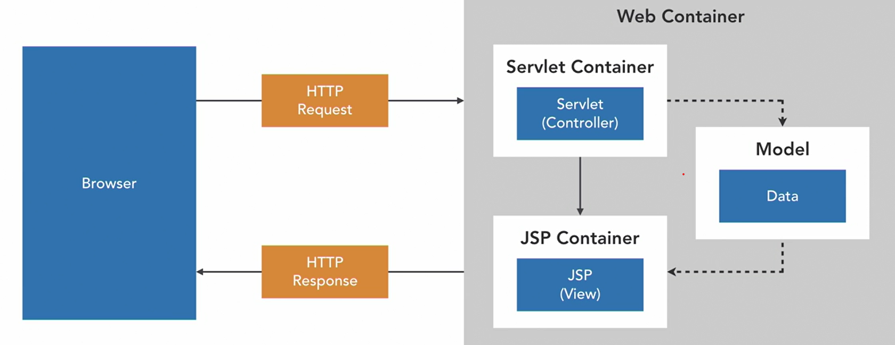
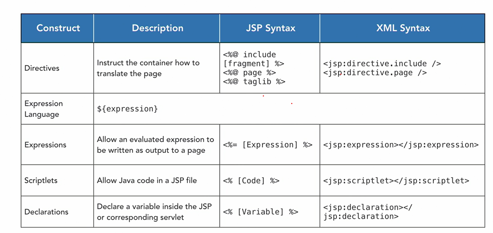
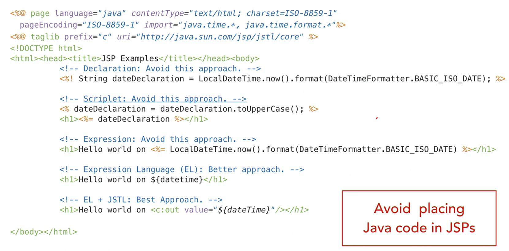
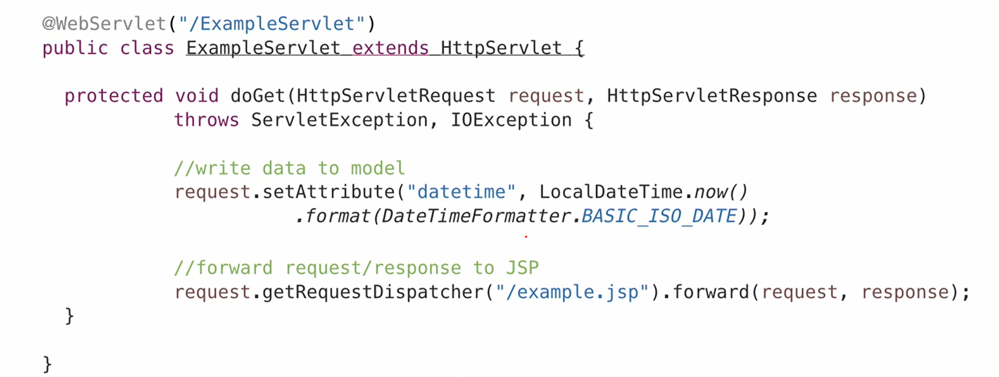
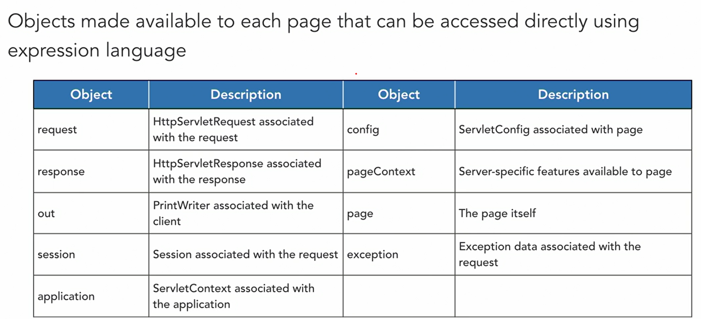

<div align="center">
     </img> 
    
<!-- Encabezado -->
### Java EE 8 | Escencial Training
#### OKR Personal Q4 2022
#### Autor 


| Nombre | Identidad | Correo |
|:-------------:| :-----:|:-----:|
| Edgar Josué Benedetto Godoy | `0801-1997-23600` | [Gmail](mailto:edgar.benedetto@baccredomatic.hn) |

</div>

_____
_____

## 3. Java Server Pages JSP
#### 3.1 Vista previa


Es una tecnología Java EE que permite crear fácilmente páginas web con contenido dinámico.

LinkedIn no crea una página HTML estática para cada curso. En cambio, el contenido estático tiene una plantilla para elementos de página genéricos como "Diseño" y luego el contenido dinámico como "Información del curso" se entremezcla para crear una página única para cada curso. Este concepto se puede aplicar fácilmente dentro de Java EE utilizando JSP. 


En este patrón se efectuan estas tareas:
1. Un navegador pasa solicitudes HTTP a un servlet.
2. Realiza su lógica y luego almacena datos en un modelo.
3. El servlet pasa la solicitud al JSP. 
4. El JSP extrae los datos del modelo y los entremezcla dentro de una plantilla para generar una página dinámica para el usuario final. 
 
El patrón conocido como **Model View Controller, o MVC** para abreviar, separa las tres preocupaciones principales de la creación de páginas web dinámicas para evitar que el código se vuelva ilegible y difícil de mantener. 

Los **JSP son documentos que mezclan contenido estático con contenido dinámico** utilizando una arquitectura **MVC**. 

Al construir una página JSP hay dos opciones de sintaxis: 
1. **Página JSP (estándar)** 
   * Podemos importar bibliotecas de etiquetas que definen cuándo se pueden usar las etiquetas JSP que nos ayudan a construir la página. 
   * Está disponible un lenguaje de expresión simple que proporciona una sintaxis concisa para hacer referencia a objetos de modelo en la página.
   * La sintaxis estándar se usa con más frecuencia. Sin embargo, crea la posibilidad de acoplamiento entre capas MVC. Si tiene un equipo bien disciplinado o un proceso co-revisado, no debería ser un problema usar la sintaxis de la página JSP. 
2. **Documento JSP (XML)** 
   * Impone una sintaxis XML estricta, y puede evitar la combinación de la lógica del controlador en la vista.

_____
#### 3.2 Partes de un JSP



Construcciones que se encuentran en las páginas JSP. Al crear una página JSP, utilizará **directivas en casi todas las páginas JSP** porque proporcionan instrucciones al contenedor JSP sobre diferentes atributos de la página, **dónde insertar contenido y qué bibliotecas de etiquetas incluir**. 

Se usa el **lenguaje de expresión para vincular datos de modelo dentro de JSP** para mostrar contenido dinámico. 

Las **construcciones restantes** son una especie de reliquias del pasado cuando la lógica de la aplicación estaba integrada en los JSP y, en su mayor parte, **deben evitarse**. 

Ejemplo de JSP que usa cada una de las construcciones JSP 



1. La parte superior del archivo esta la **directiva de página, que es obligatoria. Indica que la página está usando Java y especifica la página en codificación**.
2. La **directiva de etiquetas para incluir la biblioteca de etiquetas estándar de Java o JSTL**. Esto proporciona etiquetas útiles para cosas como la iteración o la visualización condicional de los elementos de la página.
3. **Declaraciones, scriplets, expresiones, lenguaje de expresión y el lenguaje de expresión con la etiqueta JSTL para escribir contenido dinámicamente en la página**. 

Para **cumplir con MVC**, debemos **evitar incrustar código Java** directamente en la página. Así que realmente queremos enfatizar que **debe evitar los scriptlets, las expresiones y las declaraciones**. 



De donde se obtienen los datos en un JSP:
1. Los datos provienen de un servlet que establece un atributo en la solicitud. 
2. Los atributos de solicitud son una forma de almacenamiento del lado del servidor para una solicitud en particular. Permiten adjuntar datos a la solicitud para que los utilicen otros componentes del servidor, como JSP. Se usa un objeto de tipo RequestDispatcher para reenviar la ejecución del procesamiento de solicitudes desde el servlet a la página JSP. 
3. Es una forma de lograr la navegación desde un servlet a un JSP. Así es como pasamos datos de un servlet a un JSP. 
 
 
Sin embargo, hay algunos otros datos a los que un JSP tiene acceso conocidos como **objetos implícitos: Son objetos a los que puede hacer referencia utilizando el lenguaje de expresión directamente en una página JSP sin declararlos realmente.** Puedes ver los objetos disponibles y sus descripciones. 

_____
#### 3.3 JSP Basico

1. Click derecho en webapp
2. New > Other > Web > JSP File

El **JSP que en realidad se convirtió en un servlet**. Entonces, ese marcado y el lenguaje de expresión dinámica básicamente se compilan en un servlet. Se puede ver eso dentro del servidor al navegar al directorio independiente > directorio temporal, > carpeta del proyecto, se puede ver el **Java class generada por el contenedor JSP, y en realidad es un servlet**. Por lo tanto, es importante saber que estos se compilan en servlets.

_____
#### 3.4 Java Standard Tag Library (JSTL)

La **JSTL** es una biblioteca de etiquetas que proporciona etiquetas para realizar tareas comunes, como iterar sobre una colección o realizar una comparación.

1. Agregar la directiva para usar JSTL en el JSP
  ```jsp
  <%@ taglib prefix="c" uri="http://java.sun.com/jsp/jstl/core" %>
  ```
2. Para iterar un elemento recibido en el JSP
  ```jsp
  <c:forEach items="${items}" var="item">
    <p>${item}</p>
  </c:forEach>
  ```	
3. Para imprimir un elemento recibido en el JSP
  ```jsp
  <c:out value="${item}"/>
  ```

_____
#### 3.5 Lenguaje de expresion

El lenguaje de expresión, también conocido como EL, proporciona una sintaxis simple para crear expresiones que se resuelven en objetos o métodos. 

Esto nos permite evitar el uso de scriptlets JSP y declaraciones que mezclan la lógica y el código de nuestra aplicación dentro del marcado.

También puede usar esta sintaxis con "#". Esto hace que la resolución del atributo se difiera hasta que realmente se haga referencia a él. Sin embargo, es más común usar la sintaxis del signo de dólar.

```jsp
<c:out value="#{item}"/>
```

**Puede acceder a objetos implicitos como pageContext**, que tiene información diferente sobre la página, es un objeto de solicitud, y se puede usarlo para **acceder a contextPath**.

```jsp
<c:out value="${pageContext.request.contextPath}"/>
```

También podemos acceder al mapa de parámetros usando el objeto implícito param.

```jsp
<c:out value="${param.name}"/>
```

También podemos hacer referencia a las cookies.

```jsp
<c:out value="${cookie.name}"/>
```

Se puede referenciar a métodos dentro del lenguaje de expresión. Se puede hacer referencia a la colección de elementos e invocar el método de tamaño en esa colección para obtener la cantidad de elementos en la colección. También se pueden usar operadores aritméticos para multiplicar ese tamaño por dos.

```jsp
<c:out value="${items.size() * 2}"/>
```
