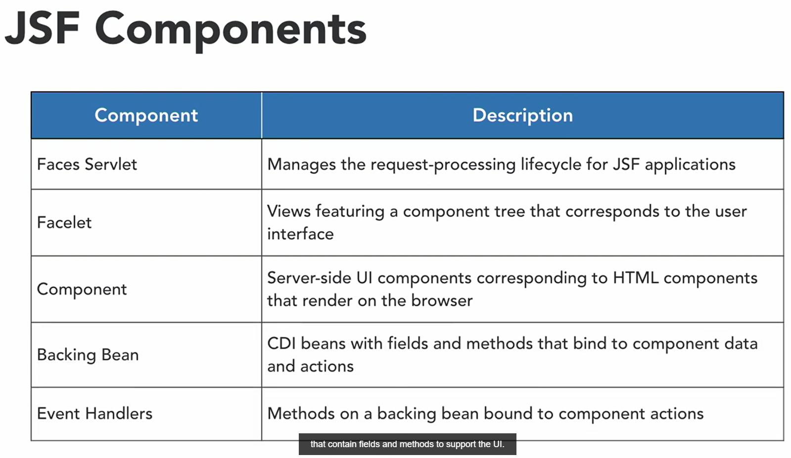
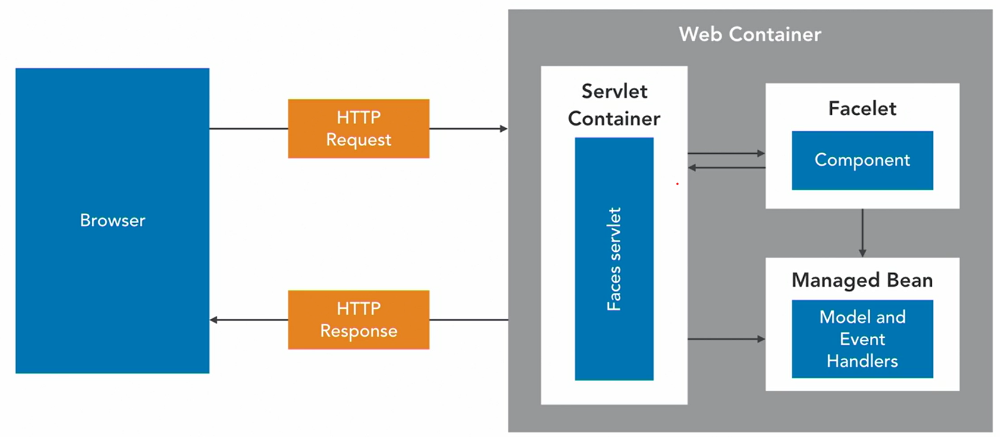
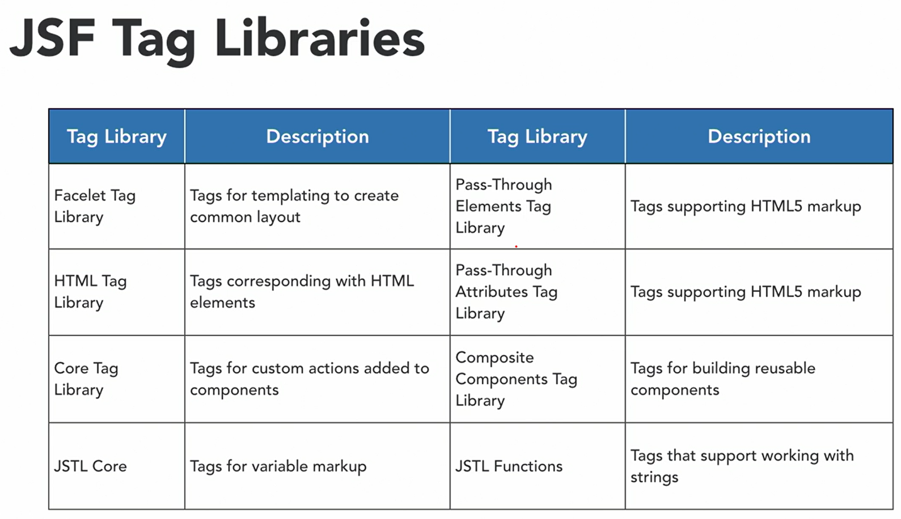
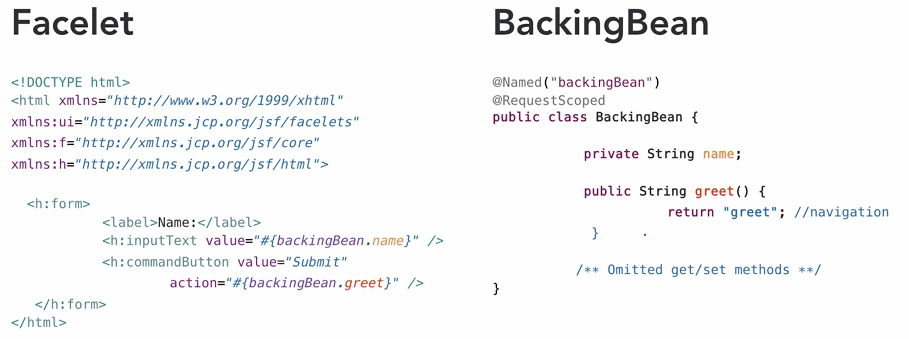

     </img> 
    
<!-- Encabezado -->
### Java EE 8 | Escencial Training
#### OKR Personal Q4 2022
#### Autor 

| Nombre | Identidad | Correo |
|:-------------:| :-----:|:-----:|
| Edgar Josué Benedetto Godoy | `0801-1997-23600` | [Gmail](mailto:edgar.benedetto@baccredomatic.hn) |

_____
_____

## 4. Java Server Faces JSF
#### 4.1 Vista previa

Java Server Faces es un **marco de aplicación web o framework** basado en Java que simplifica el desarrollo de aplicaciones basadas en web.

JSF proporciona **un modelo más cohesivo que los servlets y JSP** para crear aplicaciones web. 

Su modelo incluye:
1. Un marco de componentes de interfaz de usuario del lado del servidor
2. Soporte de plantillas y la capacidad de vincular componentes de interfaz de usuario a **java pojos conocidos como backing beans**

**Componentes clave de JSF**:
1. Dentro de **JSF** encontramos un **servlet de face**, este servlet es el **encargado de orquestar los diferentes eventos dentro del ciclo de vida de JSF**. 
2. La página o **vista JSF**, conocida como **facelet** la cual contienen un **árbol de componentes del lado del servidor** y se construyen utilizando una **combinación de XHTML, bibliotecas de etiquetas, expresiones y plantillas**. 
3. Los componentes dentro de una faceta representan representaciones del lado del servidor de los componentes de la interfaz de usuario que se representarán como HTML en el navegador. 
4. Los **componentes** dentro de la **facelet están vinculados a beans de respaldo que son pojos administrados como beans** que contienen campos y métodos para administrar la interfaz de usuario. 

**La arquitectura de JSF**:
1. Cuando un navegador pasa una solicitud HTTP al servlet de la cara, creará un árbol de componentes para la faceta identificada por la URL. 
2. Luego, los componentes en el árbol de componentes tendrán sus valores actualizados con la información correspondiente encontrada en la solicitud y los valores serán validados.
3. Después de la validación, los valores de los componentes actualizarán los campos en el bean de administración al que están vinculados con sus valores. 
4. El servlet de la cara invocará cualquier método de acción en el bean administrado, los métodos de acción finalmente devolverán una cadena que indica la próxima faceta a representar. 
5. El bean facelet devuelto tendrá su árbol de componentes actualizado con valores de cualquier bean de respaldo al que haga referencia y luego su árbol de componentes se escribirá como HTML devuelto al navegador. 

En resumen, JSF es un **marco de aplicación web Java EE** que se basa en los **principios de MVC**, dentro de la tecnología encontramos un **ciclo de vida que organiza el procesamiento de solicitudes** que implica una secuencia de pasos para **vincular los componentes de facelet del servidor a beans de respaldo basados ​​​​en pojo**. 

Al crear una página de facelet, hay varias bibliotecas de etiquetas disponibles listas para usar para usar con aplicaciones JSF. La biblioteca de etiquetas de facelet es principalmente para plantillas que crean la estructura de una página. Por ejemplo, al incorporar algo de XHTML en una plantilla principal, la biblioteca de etiquetas HTML proporciona componentes que se corresponden con elementos HTML típicos; sin embargo, estas etiquetas hacen que se creen contrapartes del lado del servidor.

Ejemplo que involucra una facelet y un bean de respaldo que une todo. La facelet aprovecha las bibliotecas de etiquetas JSF para crear un formulario simple que está vinculado a campos y métodos en el bean de respaldo utilizando lenguaje de expresión. Puede ver esto indicado por el código de colores. Cuando se hace clic en el botón de comando, la cadena de nombre en el bean de respaldo se actualizará y se invocará el método de saludo en el bean de respaldo. El método de saludo devuelve una cadena, saludo, que indica la siguiente facetlet para representar en el navegador.

_____
#### 4.2 JSF configuración en proyecto

1. Crear un nuevo Proyecto Web Dinamico
2. Definir el patrón de URL al que nos gustaría asignar el servlet Faces. Cada solicitud que coincida con el patrón se enrutará a través del servlet de Faces para que pueda realizar el ciclo de vida de JSF. 
3. Cambiar el patrón a este patrón será un asterisco ***.xhtml*** Entonces, cualquier URL que termine con una extensión xhtml se enrutará a través de nuestro servlet Faces.
4. Crear un nuevo archivo .xhtml

_____
#### 4.3 JSF Lo basico

1. Para enlazar elementos de datos de nuestra facelet, necesitamos crear un bean de respaldo
2. Crear una nueva clase. Esto va a ser un Java POJO.
3. Todo lo que necesita hacer es crear algunos campos a los que le gustaría vincular datos 
4. Crear accesos para admitir esos campos (getters & setters) esos serán utilizados por los enlaces JSF. 
5. Se debe agregar la anotación a esta clase para que JSF cree el bean, básicamente va a decir que este bean existe durante la vida de la solicitud. 
6. Dirigirnos a nuestro archivo ***.xhtml***, y podemos comenzar a enlazar con ese bean de respaldo. 

Y luego vamos a agregar algunas marcas en esta página, y es muy importante que estemos usando la biblioteca de etiquetas html dentro de JSF, en lugar de solo elementos html sin formato. Entonces, verá muchas contrapartes entre los dos, así que ahí está la contraparte JSF para un formulario, y luego podemos proporcionar un DIV antiguo normal porque no nos vamos a vincular a eso. Y luego usaremos una etiqueta de salida. Así que esto es básicamente una etiqueta de campo que llamaremos "Nombre del producto", y luego vamos a crear un texto de entrada, y el texto de entrada tendrá nuestro primer enlace. Ahora, cuando enlazamos con JSF, usamos un signo de libra y luego las llaves. Y notará que tenemos IntelliSense dentro de esa expresión, por lo que podemos echar un vistazo a nuestro bean de formulario de catálogo y luego seleccionar el campo de nombre en ese bean. Y luego, lo último que haremos, agregaremos un botón de comando al formulario y, por ahora, solo haremos que navegue a una facelet llamada "Lista". Entonces, esa será la próxima vista que vamos a crear, y le daremos a ese botón el valor "Enviar". Entonces, sigamos adelante y creemos esa página de lista. Entonces, solo voy a copiar nuestro archivo form.xhtml, y luego lo pegaremos dentro del directorio de la aplicación web, lo cambiaremos a "List.xhtml", y luego navegaremos a ese archivo. Verá que tenemos algunas marcas que se usaron para el formulario. Ya no necesitamos eso, y lo que haremos dentro de esta facelet es solo generar algunos de los datos que se vinculan a nuestro bean de respaldo al proporcionar una expresión que realiza ese enlace. Y recordará, estábamos configurando el campo de nombre, así que solo sacaremos esa información, y ahí tenemos una etiqueta de salida que mostrará el nombre. Así que es bastante simple. Ya sabes, tenemos dos facetas, y están vinculadas a un bean de respaldo común, cuyos valores se actualizarán a medida que JSF procese a lo largo de su ciclo de vida. Bueno. Veamos dónde está nuestro servidor. Está detenido, por lo que necesitamos ejecutar esta aplicación. Simplemente haga clic derecho en el proyecto y luego en "Ejecutar como", "Ejecutar en el servidor" y luego, una vez más, voy a seleccionar "Usar siempre este servidor al ejecutar este proyecto", para que no tengamos que seleccione esto cada vez. Luego veremos que se inicia el servidor y se iniciará nuestra aplicación JSF. Allí, se lanzó. Vayamos a un navegador y podemos echar un vistazo. Entonces, está nuestra forma y el nombre de nuestro producto... Vamos con una chaqueta esta vez. Y luego, cuando enviamos, puede ver que la solicitud retrocedió, el servicio de la cara aplicó los datos al bean de respaldo y luego presentó la siguiente vista, y ahí tenemos nuestro contenido dinámico con la chaqueta. Muy bien, entonces, un vistazo rápido a los conceptos básicos de JSF. Ampliaremos esto en el futuro.