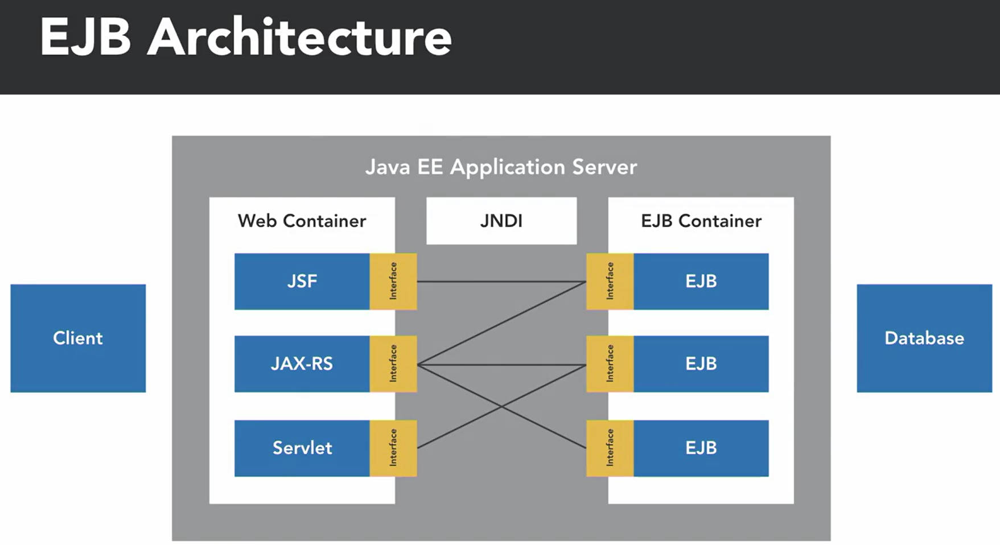
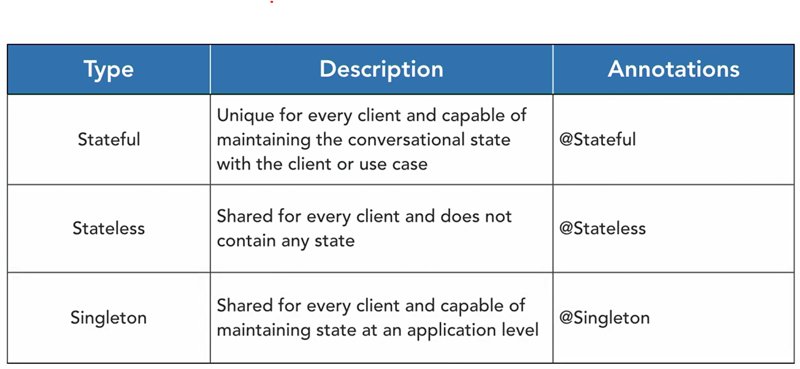

<div align="center">
     </img> 
    
<!-- Encabezado -->
### Java EE 8 | Escencial Training
#### OKR Personal Q4 2022
#### Autor 


| Nombre | Identidad | Correo |
|:-------------:| :-----:|:-----:|
| Edgar Josué Benedetto Godoy | `0801-1997-23600` | [Gmail](mailto:edgar.benedetto@baccredomatic.hn) |

</div>

_____
_____

## 5. Enterprise Java Beans EJB
#### 5.1 Vista previa

Enterprise Java Beans, o EJB, otra API dentro de Java EE que **proporciona una arquitectura de componentes estándar** para crear aplicaciones comerciales **orientadas a objetos**. 

Un **EJB es un objeto Java reutilizable que se ejecuta en un entorno de tiempo de ejecución especial conocido como contenedor EJB**. Adoptaron un enfoque basado en **POJO que usa anotaciones**. 


Los EJB generalmente manejan la **lógica de la aplicación** que admite las operaciones comerciales de un sistema, por lo que normalmente encontrará una **lógica de procesamiento centralizada que interactúa con la base de datos**. 

Esto **centraliza la lógica comercial** del sistema para que pueda ser **reutilizado por múltiples clientes**. Debido a que los EJB se administran en un contenedor, los EJB pueden **beneficiarse de servicios adicionales, como transacciones, agrupación de conexiones o subprocesos múltiples** sin escribir código explícito. 

Al diseñar un sistema con EJB, se **define una interfaz** para el EJB y se **construye una implementación**, manejan la lógica central y preocupaciones como la **persistencia de datos**. La implementación de EJB se ejecuta dentro del contenedor de EJB y **se inyecta** en otros componentes de Java EE, como **beans de respaldo JSF o servlets a través de una búsqueda JNDI (La Interfaz de Nombrado y Directorio Java es una Interfaz de Programación de Aplicaciones de Java para servicios de directorio. Permite a los clientes descubrir y buscar objetos y datos a través de un nombre.) de EJB**. 




Los EJB pueden beneficiarse de los **servicios proporcionados por el contenedor**. Cuando usamos EJB, obtenemos características todas **desde el contenedor EJB** listas para usar, tales como:
1. Transacciones 
2. seguridad 
3. Concurrencia 
4. Redes
5. Persistencia 

En un nivel alto, hay dos tipos de EJB, 
1. Beans de sesión 
   * Contienen una **lógica de aplicación reutilizable** para nuestro sistema y el cliente puede utilizarlos para realizar **operaciones empresariales básicas**
        * ***Por ejemplo*** una aplicación de comercio electrónico puede tener un Bean de sesión que administre la interfaz del carrito de compras para cada cliente del bean.
    * Hay tres tipos distintos de Session Beans que se pueden usar en nuestras aplicaciones:
        1. Los **beans de sesión con estado son únicos para cada cliente** y pueden contener estados entre llamadas que son específicos de cada cliente. 
        2. Los **beans de sesión sin estado no están asociados al cliente** y no mantienen ningún estado específico del cliente. 
        3. Los **Singleton Session Beans se instancian una vez por toda la aplicación**, y cualquier estado dentro de ellos se comparte entre todos los clientes del Singleton Bean. 

2. Beans controlados por mensajes. Los beans de sesión .  
   * Los Message Driven Beans son **componentes sin estado** que se ejecutan en el lado del servidor para procesar los mensajes entregados por Java Messaging Service o JMS.
        * ***Por ejemplo*** un sistema de mensajería puede tener un Message Driven Bean que procese los mensajes de correo electrónico entrantes y los almacene en una base de datos.

_____
#### 5.2 EJB configuración en proyecto

Al crear aplicaciones que utilizan EJB, es importante empaquetarlas de modo que el **módulo EJB, o la lógica empresarial, esté separado del módulo web** para evitar la mezcla de preocupaciones. 

Un **proyecto EJB** y un **proyecto JSF** se pueden **empaquetar juntos** dentro de un **proyecto EAR** que puede **implementar ambos proyectos a la vez**. 

Los **archivos EAR son una estrategia de empaquetado de Java EE** que nos **permite empaquetar varios módulos juntos**, solamente se crea un nuevo Proyecto de aplicación empresarial o ***Enterprise Application Project***. 

_____
#### 5.3 EJB Lo basico

Al crear un EJB se debe definir la clase que va a contener toda la lógica del negocio y también se puede crear una interfaz local para el EJB.

Esta lógica se usa en algunos beans de respaldo en JSF y lo que hemos hecho, lo empujamos hacia abajo desde el nivel web al EJB para que podamos administrar el estado y pueda ser reutilizado por otros clientes de este EJB.

_____
#### 5.4 Clientes EJB

El cliente del EJB accederá a la lista de elementos y agregará elementos a la lista a través de los métodos definidos en la interfaz local del catálogo. 

Ahora, debido a que este EJB está almacenando el estado y nos gustaría que ese estado fuera consistente en todos los clientes de nuestra aplicación, convertiremos esto en un **bean Singleton**. 

La idea es que en el bean de respaldo para el formulario y la lista dentro de la aplicación JSF se inyecte el EJB. 
Así que declararemos un nuevo campo tipo CatalogLocal y lo llamaremos catalogBean y luego agregaremos esa anotación EJB y el EJB se inyectará en este bean y podemos aprovecharlo. 

```java
@EJB
private CatalogLocal catalogBean;
```

Se debe vincular el EJB dentro de la Facelets. 
Se puede agregar la etiqueta de metadatos al JSF junto a ***viewAction*** permite **insertar un método para invocar durante el ciclo de vida de JSF**.

```html
<f:metadata>
    <f:viewAction action="#{catalogItemFormBean.init()}"></f:viewAction>
</f:metadata>
```