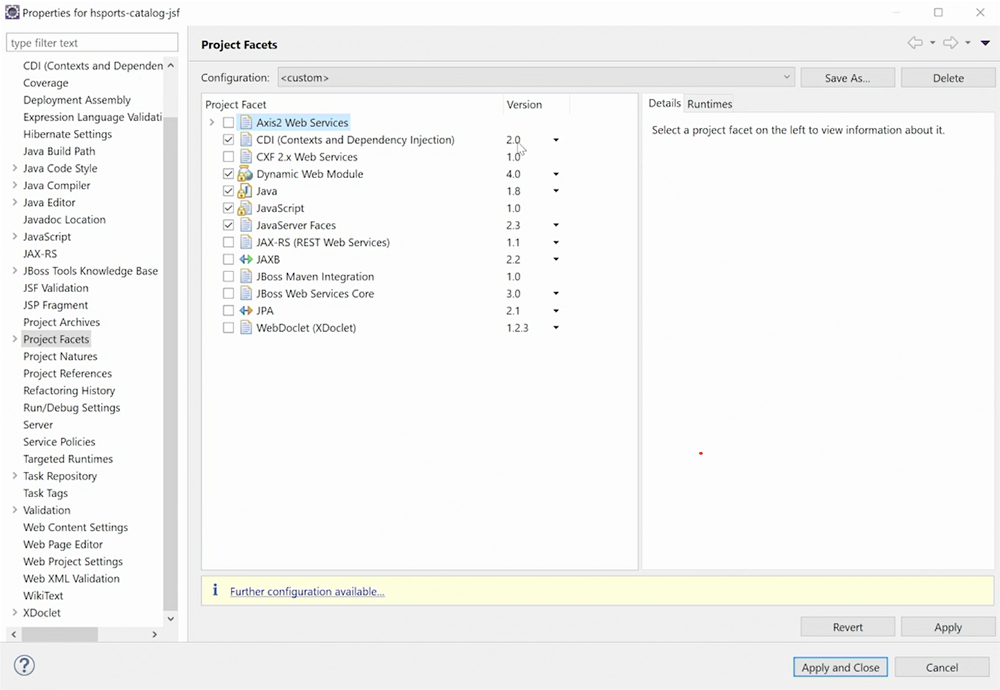

<div align="center">
     </img> 
    
<!-- Encabezado -->
### Java EE 8 | Escencial Training
#### OKR Personal Q4 2022
#### Autor 


| Nombre | Identidad | Correo |
|:-------------:| :-----:|:-----:|
| Edgar Josué Benedetto Godoy | `0801-1997-23600` | [Gmail](mailto:edgar.benedetto@baccredomatic.hn) |

</div>

_____
_____

## 6. Context Dependency Injection CDI
#### 6.1 Vista previa

CDI o inyección de contextos y dependencias se introdujo en Java EE 6. 

Hay dos **conceptos principales** en el centro de CDI, **beans e inyección de dependencia**. 

Java EE 6 introdujo el estándar de **beans administrados** que define los **beans como POJO no estáticos** que contienen **lógica empresarial que son administrados por un contenedor**. 

Los **beans administrados se pueden inyectar** en otros componentes Java EE, como servlets, recursos JAX-RS y otros beans. 

Un **objeto debe ser un bean** para usarse para la inyección de dependencia. 

La **inyección de dependencia** hace que en lugar de crear objetos usando el nuevo operador y constructor, **el contenedor crea instancias de objetos como beans**. Los beans con dependencias de otros objetos dependen del contenedor para inyectar esos objetos en lugar de instanciarlos ellos mismos. 

***Por ejemplo*** el objeto Bean A tiene una dependencia en Bean B. 
* Usando la inyección de dependencia, el contenedor inyecta Bean B en Bean A. 
* Podemos indicar que un **bean debe inyectarse en un servlet u otro bean usando la anotación Inject**. 
* El lugar donde colocamos la anotación Inyectar se conoce como el punto de inyección. 
* Al determinar qué bean inyectar, **el contenedor considera el tipo de dependencia** y selecciona un bean del tipo coincidente para la inyección. 

Dentro de las características principales de Java EE CDI se incluye:
1. La inyección de dependencia que se basa en el tipo de bean. 
2. También presenta contextos que definen el alcance de un bean dentro del contenedor CDI. 

Los beans gestionados por CDI se benefician de los servicios proporcionados por el contenedor, como el descubrimiento automático, los calificadores, los ámbitos y la denominación, que pueden aprovecharse mediante el lenguaje de expresión. 

Dentro de CDI hay dos tipos de archivos de beans que usan diferentes modos de descubrimiento. 
1. El primer tipo de archivo bean se conoce como **explícito** porque define explícitamente el modo de descubrimiento en un archivo beans.xml ubicado dentro del proyecto. Con el modo de descubrimiento, todos los objetos se crean como un bean dentro del archivo. 
2. Los archivos **implícitos** son los predeterminados. No contienen un archivo beans.xml y configuran el modo de descubrimiento para anotarlo, lo que hace que solo los beans con una anotación de definición de bean se instancian dentro del contenedor. 

Cada bean tiene un alcance que determina el ciclo de vida de sus instancias y su visibilidad para otros beans. El **ámbito predeterminado es Dependiente**, lo que hace que un bean asuma el ámbito del bean en el que se inyecta. Los **ámbitos de solicitud y sesión** se utilizan para **vincular** el ámbito de un bean a una **solicitud HTTP o una sesión HTTP**. Los beans ***ApplicationScoped*** tienen un alcance mayor que hace que una **única instancia del bean se comparta en toda la aplicación**. Finalmente, el bean **ConversationScoped** es particular de JSF, y el desarrollador lo controla explícitamente a través de su código de aplicación.

_____
#### 6.2 CDI configuración en proyecto

1. Permitir CDI en el proyecto.
    En propiedades dentro de la sección de facetas del proyecto, en el cuadro de diálogo que aparece, 

    

    Dentro de su archivo **web.XML**, obtendrá un archivo **Beans.XML**. 

    En el archivo **beans.xml** se puede cambiar la opción de **Beans Dependency Mode** de solo buscar beans anotados a buscar ***all***/todos los beans,con lo cual ya no será necesario anotar **ninguna de nuestras clases para convertirlas en beans**. Simplemente se crearán automáticamente como un bean, cuando sea necesario, en el contenedor CDI. 

2. Crear un bean de inventario.
   1. Pasos vistos en el curso
       * Los **beans** en realidad van a ser un **servicio** de inventario, que nos ayuda a administrar estos artículos de inventario que va a extender la interfaz serializable.
       * El artículo de inventario es solo un **POJO simple** que permite rastrear la cantidad de inventario para un artículo de catálogo en particular. 
       * Se pueden definir métodos como el método de creación de elementos, el método de creación de elementos. El **Service** queda de esta forma:
            ```java
            package com.linkedin.jsf;

            import java.io.Serializable;

            public interface InventoryService extends Serializable {
            
                public void createItem(Long catalogItemId, String name);

                public Long getQuantity(Long catalogItemId);

            }
            ```
       * Crear una **implementación de la interfaz**, la implementación de la interfaz suele llevar **Local** en el nombre de la clase. La implementación del Service queda de está forma:
            ```java
            package com.linkedin.jsf;

            import java.util.HashMap;
            import java.util.Map;

            public class LocalInventoryService implements InventoryService {

                private Map<Long, InventoryItem> items = new HashMap<>();
                
                @Override
                public void createItem(Long catalogItemId, String name) {
                    long inventoryItemId = items.size() + 1;
                    this.items.put(inventoryItemId, new InventoryItem(inventoryItemId, catalogItemId, name, 0L));
                }

                @Override
                public Long getQuantity(Long catalogItemId) {
                    return 0L;
                }

            }
            ```
       * No es necesario anotar esta clase como otros marcos para hacer de esta clase un bean, por defecto en el modo de descubrimiento de bean, cada clase se crea como un bean, según sea necesario, según las necesidades de inyección de la aplicación.
   2. Pasos sugeridos por Copilot
       * Crear una interfaz de servicio de inventario que extienda la interfaz serializable. 
       * Crear una clase de servicio de inventario que implemente la interfaz de servicio de inventario. 
       * Crear una clase de artículo de inventario que represente un artículo de inventario. 
       * Crear una clase de prueba de servicio de inventario que use el servicio de inventario para agregar un artículo de inventario y luego recuperarlo.

_____
#### 6.3 Puntos de inyección

* Usar CDI para inyectar un bean en un bean de respaldo JSF. 
  * El **punto de inyección** es un **método de acceso** que se usa para **inyectar** una **dependencia** en un **bean**.
  * Al ser un bean de respaldo se le pueden inyectar dependencias.
  * Si se usaba la anotación **@EJB** para inyectar un bean, ahora se usa la anotación **@Inject** a esto se le conoce como el **punto de inyección**. 
  * Esto hará que CDI tome esa instancia de bean del contenedor y la inyecte para poder aprovecharla dentro del propio bean.
    ```java
    @Inject
	private CatalogLocal catalogBean;
	
	@Inject
	private InventoryService inventoryService;
    ```
_____
#### 6.4 Scopes o alcances

Se usan para **controlar el ciclo de vida** de los **beans**.
**Dependent** es el alcance predeterminado para un bean.

El contexto de la aplicación se comparte entre todas las solicitudes de servlet, las invocaciones de servicios web, las invocaciones de métodos remotos de EJB, las invocaciones de métodos asíncronos de EJB, los tiempos de espera de EJB y las entregas de mensajes a beans controlados por mensajes que se ejecutan dentro de la misma aplicación. El contexto de la aplicación se destruye cuando se cierra la aplicación.

Los alcances o **scopes** permiten **asociar un bean con un contexto que determina la visibilidad del bean** y ayuda a administrar su ciclo de vida. El alcance predeterminado para un bean es dependiente del bean en el que se inyecta.

**RequestScoped:** Se basa en una **instancia de RequestAttributes** vinculada a un subproceso, que se puede **exportar a través de RequestContextListener, RequestContextFilter o DispatcherServlet**. Es un atributo que se usa para **determinar el alcance** en el cual el objeto java puede ustilizarse las posibilidades son: **page, request, session o application**. Por lo tanto, no mantendrá ningún estado durante la sesión del navegador. Y eso se debe al ciclo de vida y su alcance. 

**ApplicationScoped:** Especifica que un bean tiene un alcance de aplicación. Si bien ApplicationScoped **debe asociarse con el contexto de la aplicación integrada** requerida por la especificación, las extensiones de terceros también pueden asociarlo con su propio contexto. El comportamiento que se describe a continuación solo está relacionado con el contexto de la aplicación integrada. Si el bean tiene el scope ApplicationScoped, ese **estado o esa instancia del bean es persistente en distintos navegadores navegadores**.

_____
#### 6.5 Calificadores

Cuando **varios beans tienen el mismo tipo**, se debe especificar a CDI qué bean **debe inyectarse en un punto de inyección**, para esto **se usan los calificadores** en CDI (también se pueden **crear clasificacdores**)

De forma **predeterminada**, cada bean y punto de inyección tiene las **anotaciones any y default**. Se puede producir un error dado que hay **beans ambiguos** que podrían **satisfacer la dependencia** para el bean al que se quiere inyectar. 

En ese punto es donde se **agregan los calificadores** y hay 2 formas de hacerlo
1. **Nombrar calificadores usando la anotación @Named:**
    La anotación ```@Named``` lo que permite **dar un nombre al bean** el cual **por buenas prácticas**, será el **nombre de clase del bean** con la primer letra minúscula usando camell case ```@Named(remoteInventoryService)```. La misma anotación debe estár en el punto de inyección del bean. 
2. **Calificadores personalizados:**
    Con Cntrl+N se debe buscar ***Quialifier Anotation*** y luego escribir el nombre seleccionado para el nuevo calificador como ***RemoteService***, paralelamente (se puede usar un calificador personalizado y también la anotación ```@Alternative```) o cuando no se usan calificadores personalizados se puede usar la anotación ```@Alternative``` la cual le indica a CDI que **no use esta instancia de bean a menos que lo declaremos explícitamente**, se considera es una forma de eliminar un bean de ser considerado para la inyección.
    ```java	
    @ApplicationScoped
    @RemoteService
    public class RemoteInventoryService implements InventoryService {
        ...
    }

    @SessionScoped
    @Named
    public class CatalogItemFormBean implements Serializable {

        @Inject
        private CatalogLocal catalogBean;
        
        @Inject
        @RemoteService
        private InventoryService inventoryService;
        ...
    }
    ```

_____
#### 6.6 Métodos del productor o Producer Methods

CDI brinda soporte para clases de fábrica que otorgan a los desarrolladores un mayor control sobre la creación de instancias de beans. Este soporte se logra usando la anotación ```@Produces```, que nos permite **crear métodos que actúan como una fuente de objetos que pueden ser inyectados por el contenedor CDI**. 

Esto puede ser necesario en circunstancias en las que **un tipo de bean debe determinarse dinámicamente en tiempo de ejecución**, o cuando un **objeto requiere una lógica de creación de instancias especial**. 

Para usar la anotación ```@Produces``` para manejar estas situaciones se **debe crear nueva clase**  Se puede abstraer creando la clase como una fábrica para crear un servicio de inventario en lugar de permitir que el contenedor CDI solo cree instancias de clases anotadas.  Al importar la anotación ```@Produces``` se le señala a CDI que el **método que va a crear dinámicamente un bean**. 
    
```java
public class InventoryServiceFactory {

	@Produces
	public InventoryService createInstance() {
		
		InventoryService inventoryService = null;
		
		if(LocalDateTime.now().getHour() > 12) {
			inventoryService = new LocalInventoryService();
		} else {
			inventoryService = new RemoteInventoryService();
		}
		
		return inventoryService;
	}
}
```

_____
#### 6.7 Métodos de interceptor o Interceptor methods

Los interceptores **proporcionan un mecanismo para encapsular** este tipo de código de una forma sencilla y aplicarlo a nuestros métodos **sin interferir directamente**. Los interceptores proporcionan una estructura para este tipo de conducta de forma que puedan ser ampliados y extendidos fácilmente en una clase.

CDI brinda soporte para interceptores que permiten a los desarrolladores implementar preocupaciones transversales en sus aplicaciones, como registro, auditoría y seguridad. Los interceptores **se activan cuando se invocan métodos en un bean en particular**, lo que permite **introducir la lógica transversal**. 

Pasos para crear un método interceptor:
1. Con CNTRL+N se debe buscar ***Interceptor Binding Anotation*** y luego escribir el nombre seleccionado para el nuevo interceptor como ***Logging***.
2. Se puede apuntar a diferentes secciones de una clase, como el tipo y el método (seleccionados por defecto) que es donde podemos aplicar este interceptor. 
3. Se debe **crear un segundo objeto** con CNTRL+N se debe buscar **Interceptor**. Luego se proporciona un nombre de interceptor de **LoggingInterceptor**. 
4. **Agregar un enlace o binding** de interceptor que será el creado en el paso 1
5.  Se debe dejar un método de invocación el cual asocia esa anotación de enlace con el interceptor de modo que cuando se use la anotación de enlace, hará que se invoque dicho método de invocación de interceptores. Eso **permite agregar esa lógica transversal** 
6. Hay diferentes datos de contexto, es una especie de metadatos sobre la llamada al método, para que pueda aplicar seguridad, registro, etc. 
7. Se debe invocar el método de ```proceed();``` que permitirá que continúe la ejecución del método. Aquí es donde, si estuviera aplicando seguridad, no permitiría que continuara la invocación del método. 
8. **Agregar ese enlace de interceptor o interceptor binding a un servicio** para que cada vez que se invoque el servicio se ejecute el servicio, con lo que ya se podría eliminar la anotación ```@Alternative``` del servicio si se tiene dado que permite asegurar de que ese servicio se inyecte con el interceptor.  