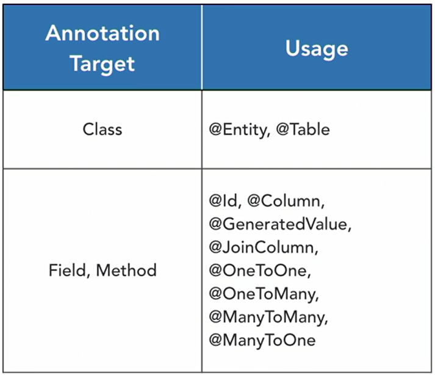
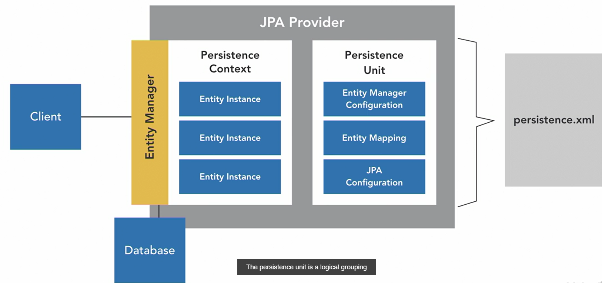
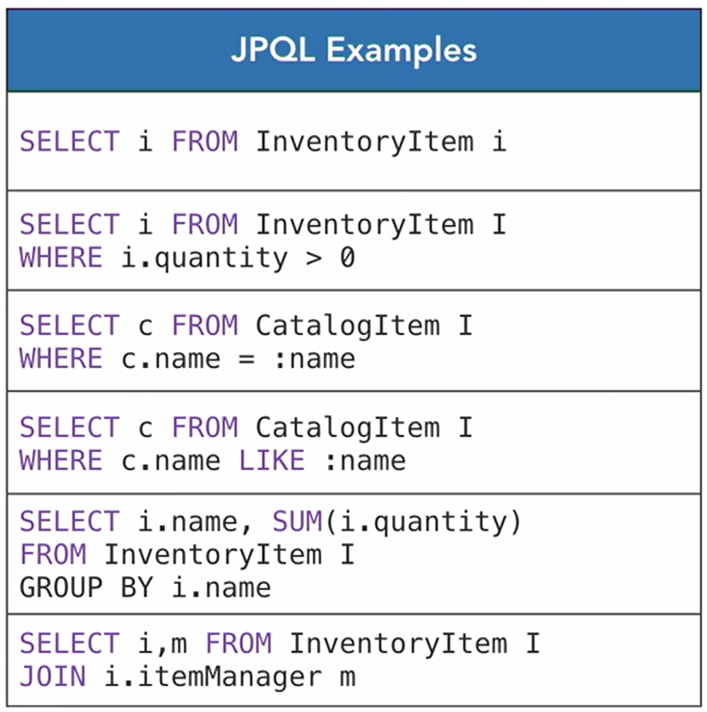
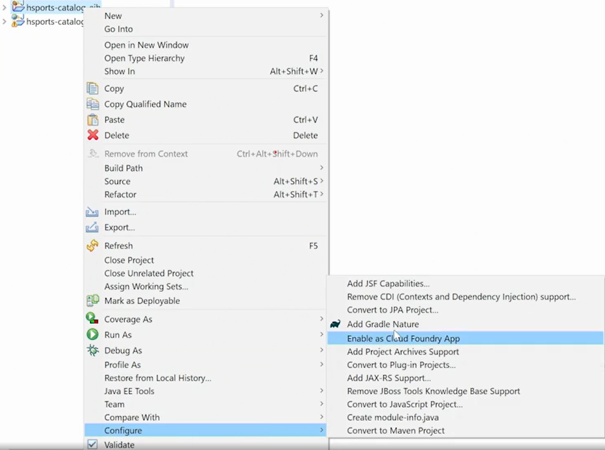
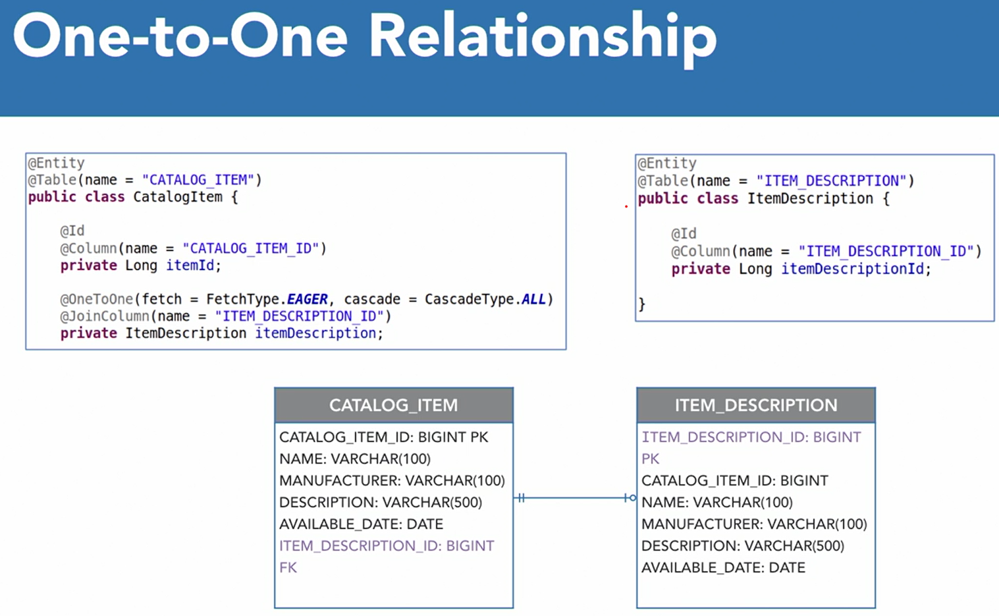
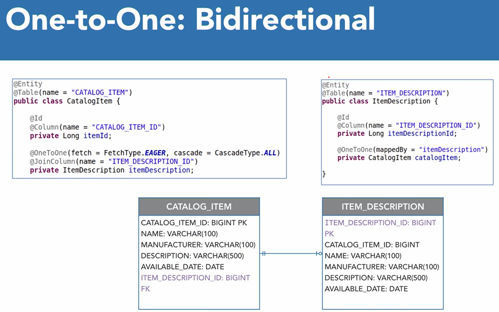
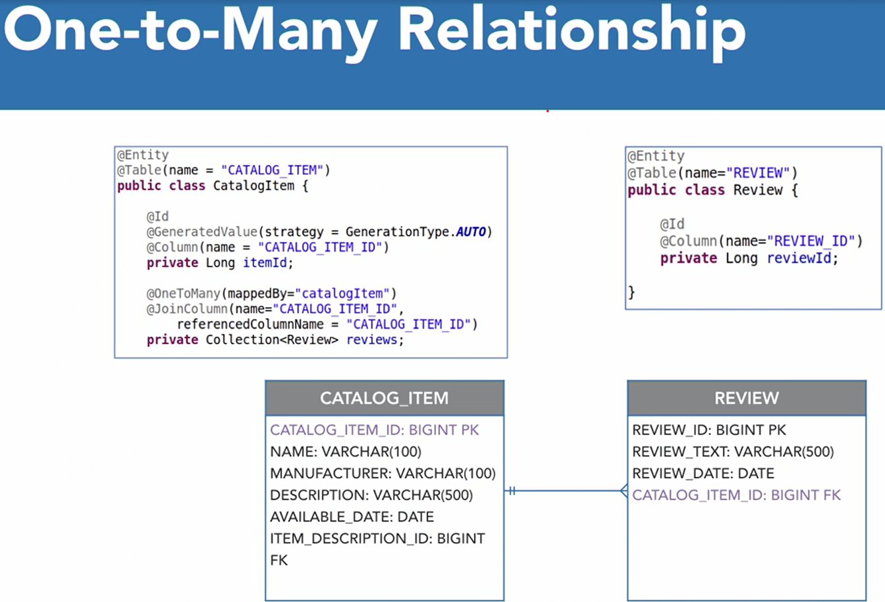
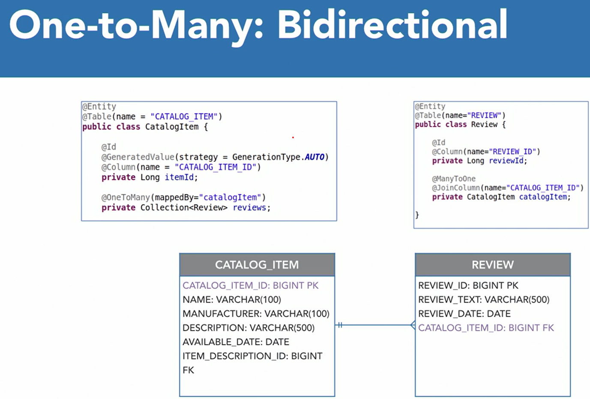
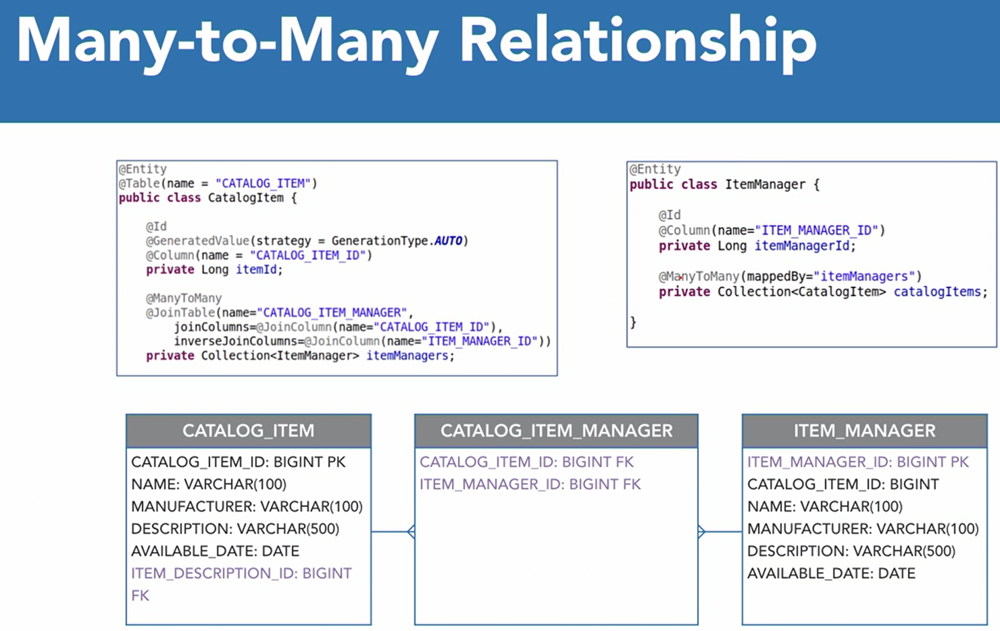

<div align="center">
     </img> 
    
<!-- Encabezado -->
### Java EE 8 | Escencial Training
#### OKR Personal Q4 2022
#### Autor 


| Nombre | Identidad | Correo |
|:-------------:| :-----:|:-----:|
| Edgar Josué Benedetto Godoy | `0801-1997-23600` | [Gmail](mailto:edgar.benedetto@baccredomatic.hn) |

</div>

_____
_____

## 7. Java Persistence API JPA
#### 7.1 Vista previa

La API de persistencia de Java, o JPA es una API de Java EE para **acceder, conservar y administrar objetos de Java y una base de datos relacional**. Hace que sea increíblemente simple **realizar operaciones CRUD** en un almacén de datos relacionales. 

JPA **admite el mapeo relacional de objetos (ORM)**, esto simplifica enormemente la forma en que leemos, escribimos, actualizamos y eliminamos datos en una base de datos de las aplicaciones Java, lo que también se conoce como persistencia de datos. Usando el **mapeo relacional de objetos**, es posible **escribir aplicaciones Java que interactúen con una base de datos relacional sin escribir SQL**. 

Al usar JPA, los desarrolladores solo trabajan con objetos y el proveedor de JPA maneja el SQL subyacente.  

JPA normalmente se divide en cuatro áreas:
1. Es importante tener en cuenta que JPA es solo una especificación o API. La implementación subyacente está construida por proveedores de JPA. El **más popular es hybernate**, que es una **implementación de JPA proporcionada por JBoss**.
2. La API de JPA brinda soporte para objetos clave como EntityManager, que se utiliza para administrar entidades. 
3. El lenguaje de consulta de persistencia de Java, o JPQL, permite escribir una consulta similar a SQL que está basada en objetos. Estas consultas funcionan en todos los proveedores de bases de datos y son irrelevantes para el almacén de datos subyacente. 
4. La API de criterios que se encuentra en JPA proporciona una API programática de tipo seguro para crear consultas contra entidades. Es muy detallado trabajar con él, pero si está buscando seguridad tipográfica, es la mejor opción. 

Una **entidad es un objeto que representa una tabla dentro del esquema de su base de datos**. Se aplican anotaciones en la clase o entidad y el campo para asignarlos a la estructura de la base de datos relacional subyacente. Estas anotaciones denotan los nombres de tablas, columnas, claves externas e información sobre las relaciones con otras entidades conocidas como asociaciones. 



Cuando se ejecuta una consulta con JPA, cada fila de la consulta se convertirá en una instancia de la entidad en particular. También es importante comprender que las **entidades funcionan mejor con claves sustitutas**, por lo que se **crean identificadores únicos para cada instancia**. 

Las aplicaciones JPA **se empaquetan con un archivo persistence.xml** que proporciona propiedades de configuración para el proveedor JPA y una definición de unidades de persistencia. La **unidad de persistencia es una agrupación lógica que contiene metadatos sobre EntityManager**, entidades administradas y sus datos de mapeo asociados. La **unidad de persistencia contiene toda la información que puede instruir a un EntityManager sobre cómo persistir las entidades en una base de datos relacional**. 



##### EntityManager 
Es la **interfaz** clave para **realizar operaciones en la base de datos relacional**. La interfaz EntityManager expone un conjunto de métodos que aceptan entidades o sus ID para que puedan consultarse, insertarse, actualizarse y eliminarse. Normalmente, cuando se trabaja con el servidor de aplicaciones Java EE, el EntityManager lo proporciona el contenedor y **se inyecta en beans como una dependencia**. Un EntityManager se crea utilizando información en la unidad de persistencia y se asocia con un contexto de persistencia. El contexto de persistencia contiene las instancias de la entidad y gestiona su ciclo de vida. El EntityManager puede persistir las entidades dentro del contexto de persistencia en el almacén de datos relacionales.

##### Lenguaje de consulta de persistencia de Java JPQL 
Es muy similar a SQL, excepto que las consultas se escriben contra el modelo de objetos. Con JPQL, puede crear consultas que realicen operaciones de selección, actualización y eliminación en la base de datos. Falta de soporte para operaciones de inserción con JPQL. Dentro de las consultas JPQL, se pueden usar corolarios para funciones relacionales comunes como cláusulas where, declaraciones like, parámetros, operadores agregados e incluso uniones. 



##### API de criterios CriteriaBuilder

La API de criterios de JPA proporciona una API programática de tipo seguro para crear consultas contra entidades. Es muy detallado trabajar con él, pero si está buscando seguridad tipográfica, es la mejor opción. 

CriteriaBuilder se limita a realizar consultas y es útil cuando una **consulta debe ser dinámica**, como cuando la **cláusula where se genera de forma condicional**. El uso de CriteriaBuilder para estas situaciones es un poco detallado, pero proporciona una forma segura de generar consultas dinámicas seguras, lo cual es un requisito común en las aplicaciones. Así que esa es una mirada de alto nivel a JPA. Ahora pasaremos a las lecciones prácticas para obtener algo de experiencia trabajando con la API.

_____
#### 7.2 JPA configuración en proyecto

La aplicación debe configurarse para conectarse a una fuente de datos y debe configurarse una unidad de persistencia. Se puede configurar un nuestro proyecto EJB para usar JPA con un Eclipse. Pasos para configurar un proyecto JPA:
1. Botón derecho en el proyecto EJB, y luego podemos ir a ***configurar*** dentro del menú y seleccionar ***Convertir a proyecto JPA****************. 
    
2. Esto abrirá un diálogo que nos permite seleccionar nuestra versión JPA y aplicar la faceta del proyecto a nuestro proyecto EJB, luego obtendremos un archivo **persistence.xml** dentro del proyecto. Ese archivo persistence.xml tiene soporte de GUI dentro de Eclipse que nos permite **especificar información como la conexión**. 
3. Si se debe configurando una fuente de datos como Oracle o tal vez MySQL, necesitaría configurar el controlador, la URL y luego el nombre de usuario y la contraseña para su base de datos. 
4. Una opción importante que se debe configurar es la generación de esquemas, por lo que dentro de los proveedores de JPA, hay soporte para que su DDL (Data Definition Lenguage) se cree automáticamente dentro de sus bases de datos. Si se trabaja con la BD de producción debe estar en **Ningungo**. 
5. Si se necesita, podemos especificar otras propiedades que instruyan al proveedor de JPA sobre su comportamiento, dichas propiedades de configuración se pueden proporcionar en la pestaña de propiedades. 

_____
#### 7.3 Mapeo de entidades

Los proveedores de **JPA usan anotaciones de entidades** para determinar **cómo conservar nuestras entidades en una base de datos**. Las **clases** que son solo un **POJO básico** pueden **convertirse en una entidad simplemente agregando la anotación** ```@Entity```. Otra anotación a nivel de **clase que se puede agregar la entidad** es la anotación ```@Table(name="TABLE_NAME")```, permite especificar el nombre de la tabla dentro de la base de datos relacional que se corresponde con esta entidad. 

Las **anotaciones a nivel de campo**, ```@Id``` para indicar que el ID del elemento es nuestra **clave principal** en esta entidad, se puede especificar el **nombre de la columna** con la anotación ```@Column(name="COLUMN_NAME")```, **no es necesario que coincida con el nombre del campo**, para las **columnas de clave principal**, se usa la anotación ```@GeneratedValue(strategy=GenerationType.AUTO)```, se le indica al proveedor de JPA que es una **clave sustituta** la cual **será generada por algún tipo de mecanismo**. Las bases de datos relacionales tienen **varias formas diferentes de crear estas claves sustitutas**, ya sea a través de una secuencia o un número automático. 

1. **Auto:** Seleccionará automáticamente el tipo apropiado 
2. **Identity:** Cuando tengamos un número automático 
3. **Sequence:** Se usa cuando tenemos una secuencia dentro de la base de datos  
4. **Table:** Cuando las claves sustitutas reales se rastrean dentro de una tabla en la base de datos. 

```java
@Entity
@Table(name="CATALOG_ITEM")
public class CatalogItem {

	@Id
	@Column(name="CATALOG_ITEM_ID")
	@GeneratedValue(strategy=GenerationType.AUTO)
	private Long itemId;
	
	@Column(name="NAME")
	private String name;
    ...
}
```

_____
#### 7.4 Conceptos básicos de EntityManager

Para **conservar las entidades dentro de nuestra aplicación**, necesitaremos trabajar dentro de EntityManager. El **EntityManager expone operaciones que nos permiten realizar operaciones CRUD** contra nuestro almacén de datos. 

Lo primero que es **inyectar el EntityManager** usando la anotación ```@PersistenceContext```. aplicado a un campo de tipo EntityManager y eso hará que el contenedor inyecte un EntityManager que se puede usar para realizar operaciones de persistencia. 

```java	
@Singleton
@LocalBean
public class Catalog implements CatalogLocal {

    @PersistenceContext
    private EntityManager entityManager;
    ...
}
```

La lógica para extraer todos nuestros CatalogItems usando EntityManager se usa el método createQuery en EntityManager con JPQL para construir una consulta. Obtener c, que es un alias a partir del cual se crea y luego especificamos el nombre de la entidad que nos gustaría obtener y esto hará que todos los elementos del catálogo se seleccionen de nuestra base de datos. Ahora, podemos escribir fuertemente esta llamada proporcionando un segundo argumento. Entonces simplemente quiere saber el tipo de entidad. Entonces solo proporcionamos la clase y luego ejecutamos getResultList y eso devolverá una colección de CatalogItems.

```java
@Override
public List<CatalogItem> getCatalogItems() {
    return this.entityManager.createQuery("SELECT c FROM CatalogItem c", CatalogItem.class).getResultList();
}
```

Se puede usar EntityManager para almacenar un elemento dentro de la base de datos. para insertar un CatalogItem se usa el método ***persist*** lo que la hace persistir como una nueva entidad en nuestra base de datos. 

```java
@Override
public void addCatalogItem(CatalogItem catalogItem) {
    this.entityManager.persist(catalogItem);
}
```

Si se manjea como **un bean de sesión**, solo porque se quiere mantener ese estado en diferentes llamadas, al interactuar con base de datos, la persistencia y el estado se trasladan a la base de datos relacional, por lo que el alcance se debe cambiar a ```@RequestScope``` para que el estado se mantenga dentro de la misma llamada. 

_____
#### 7.5 Gestión avanzada de entidades

Con el EntityManager se puede realizar las siguientes operaciones: 
1. **Encontrar** un elemento por su ID se proporciona el tipo de entidad y luego pasamos el ID
    ```java
    @Override
	public CatalogItem findItem(Long itemId) {
		return this.entityManager.find(CatalogItem.class, itemId); 
	}
    ```
2. **Eliminar** un elemento donde hay un método de eliminación pero primero el que se verifica si el EntityManager contiene la entidad en particular. Se comprueba si está dentro de ese contexto de persistencia. Si es así, simplemente continuamos y pasamos la entidad al método de eliminación. Si no está dentro del contexto de persistencia, usamos el EntityManager para realizar una fusión. Y esto agregará la entidad al contexto de persistencia. Y luego notará que el tipo de devolución del método de combinación es nuestro tipo de entidad. Por lo tanto, la entidad pasará al método de eliminación. 
    ```java
    @Override
	public void deleteItem(CatalogItem item) {
		this.entityManager.remove(this.entityManager.contains(item) ? item:this.entityManager.merge(item));
	}
    ```
3. **Buscar** por nombre necesita que proporcionemos un predicado, para que podamos decir cual es el nombre a buscar. Podemos parametrizar una consulta JPQL, lo que hace la busqueda más segura, evitando la inyección de SQL. Lo que vamos a hacer es rodear el valor provisto con comodines y eso permitirá que la operación LIKE sea comodín para que no tengamos que empezar o terminar. Y luego simplemente devolvemos la lista de resultados.
    ```java
    @Override
	public List<CatalogItem> searchByName(String name) {
		return this.entityManager.createQuery("select c from CatalogItem c " +
				" where c.name like :name", CatalogItem.class).setParameter("name", "%" + name + "%").getResultList();
	}
    ```
    
Dentro de la página de lista, en el formulario se debe permitir buscar en la tabla de datos, al hacer clic en el botón de comando, se debe invocar el método de búsqueda por nombre en el Bean el cual está configurado para usar Ajax dentro de JSF, por lo que no será un viaje completo al navegador, solo **será una solicitud de Ajax que actualizará la tabla de datos**. 

```html
<h:form>
	<h:outputLabel value="Search by Name:" />
	<h:inputText id="searchInput" value="#{catalogItemFormBean.searchText}" />
	<h:commandButton action="#{catalogItemFormBean.searchByName}" value="Search">
		<f:ajax execute="searchInput" render="dataTable" />
	</h:commandButton>
</h:form>
```

**ConversationScope:** El alcance está activo durante todas las fases estándar del ciclo de vida de cualquier solicitud JSF faces o no faces. Se necesita implementar la interfaz Serializable. El contexto de la conversación proporciona acceso al estado asociado con una conversación en particular. Cada solicitud JSF tiene una conversación asociada. Se puede inyectar un objeto de conversación, el cual permitirá administrar explícitamente el alcance del Bean dentro de nuestro código. Esta asociación es gestionada automáticamente por el contenedor según las siguientes reglas: 
   * Cualquier solicitud JSF tiene exactamente una conversación asociada. 
   * La conversación asociada con una solicitud JSF se determina al comienzo de la fase de vista de restauración y no cambia durante la solicitud.

_____
#### 7.6 Asociaciones de entidades

Cuando construimos un modelo de objetos, es común que los campos de un objeto hagan referencia a otros objetos. Por ejemplo, un pedido puede contener una lista de objetos de tipo artículo. Cuando estos objetos o entidades necesitamos mapear estas asociaciones o relaciones, que no son extremadamente complejas pero son más difíciles que simplemente mapear una columna de tabla. En una base de datos relacional, las tablas se referencian mediante una relación de clave externa. Cuando se asigna una **asociación en JPA**, estamos **instruyendo al administrador de la entidad sobre cómo persistir dos objetos que tienen una relación de clave externa subyacente en la base de datos entre sus tablas**. Hay varias consideraciones al mapear una asociación de entidades:
1. **Cardinalidad:** Se debe determinar la **cardinalidad de la relación**. Es fundamental identificar si las entidades están relacionadas a través de una relación de uno a uno, de uno a muchos o de muchos a muchos. 
2. **Dirección:** Determinar si existen referencias en uno o ambos objetos. Esto se conoce como su dirección. Las asociaciones pueden ser unidireccionales, lo que significa que solo una entidad tiene una referencia a la otra o bidireccionales, lo que significa que ambas entidades tienen relaciones entre sí. 
3. **Cascada:** Cuando se produce una operación persistente en una entidad asociada a otra entidad. ¿La operación en esa entidad, digamos una inserción, cae en cascada a todas las entidades asociadas dentro de esa entidad? Esto se conoce como el tipo cascada. 
4. **Recuperar:** El mismo concepto se aplica a las consultas. Si recuperamos una entidad, ¿queremos recuperar inmediatamente las entidades asociadas? ¿O debemos esperar a solicitarlos de la base de datos hasta que estén referenciados? 

**Simple mapeo unidireccional uno a uno que representa una relación entre dos tablas**, el artículo del catálogo y la descripción del artículo. En esta relación, la tabla de artículos del catálogo almacena un artículo que tiene una sola descripción en la tabla de descripción de artículos. La clave externa reside en la tabla de elementos del catálogo, lo que la convierte en propietaria de la relación. Esto determina **dónde colocamos la anotación de la columna de unión que mapea la asociación al identificar la clave externa** utilizada por el administrador de la entidad para unir las tablas. Se aplica esta anotación en el objeto del elemento del catálogo junto con la anotación uno a uno para mapear las entidades. La anotación uno a uno denota los tipos de recuperación y cascada también. 

 

La misma asociación anterior solo en su **forma bidireccional**. La relación se vuelve bidireccional al **agregar la referencia al artículo del catálogo en el objeto de descripción del artículo**. Esta referencia debe anotarse con la anotación uno a uno que contiene el elemento mapeado por. Eso apunta al campo de descripción del artículo en el objeto del artículo del catálogo. 

 

**Relación unidireccional de uno a muchos**. Se aplica una anotación de **uno a muchos para recopilar las reseñas asociadas con el artículo del catálogo. Esta anotación utiliza el elemento de nombre de columna al que se hace referencia para asignar la clave externa en la tabla de revisión, creando la asignación para la asociación. 

 

Esta es la misma relación anterior modelada como una **relación bidireccional** que hace que la anotación de la columna de unión se desplace al lado propietario de la relación y se aplique la anotación de muchos a uno. 

 

**La relación más compleja para mapear es de muchos a muchos**, porque a veces requiere una tabla de unión. No creamos una entidad para la tabla de combinación, pero usamos la anotación de la tabla de combinación para hacer referencia a la tabla y las columnas utilizadas para unir las entidades.

 

_____
#### 7.7 Asociaciones de mapeo

La asociación muchos a muchos es la asociación más difícil de mapear en JPA. Lo primero que debemos hacer es usar nuestro administrador de entidades para fusionar el catalago en el contexto de persistencia para que el elemento pueda actualizarse. Cuando se realiza una actualización usando JPA, estamos usando la operación de combinación en el administrador de entidades. 

```java
@Override
public void saveItem(CatalogItem item) {
	this.entityManager.merge(item);
}
```

Ahora, el administrador de la entidad necesita saber cómo mapear esta asociación de muchos a muchos, se debe actualizar el mapeo dentro de nuestra clase de elemento de catálogo para incluir la asociación muchos a muchos: 
1. Agregar la **anotación muchos a muchos** y vamos a importar esa anotación y luego especificar un tipo de cascada y ese tipo de cascada va a ser **ALL**, esta entidad persistirá en cualquier entidad asociada y luego también estableceremos el tipo de recuperación en ansioso o **EAGER**. Tan pronto como recuperemos esta entidad de la base de datos, queremos cargar todas las entidades asociadas con esa entidad.
2. Agregar la **tabla de unión** y en la **anotación de la tabla** de unión que usamos para mapear muchos a muchos, encontrará un elemento de columnas de unión que acepta una matriz de anotaciones de columnas de unión. Luego agregar una columna de combinación dentro de esta anotación, de modo que anidamos anotaciones aquí y luego solo especificamos el nombre de la columna de combinación para asignar al elemento del catálogo de la tabla de combinación. Por lo tanto, será la columna de identificación del artículo del catálogo y luego debemos especificar otra columna de combinación y esta será la columna de combinación inversa. 

```java
@ManyToMany(cascade = CascadeType.ALL, fetch=FetchType.EAGER)
@JoinTable(joinColumns = @JoinColumn(name="CATALOG_ITEM_ID")
	, inverseJoinColumns = @JoinColumn(name="ITEM_MANAGER_ID"))
private List<ItemManager> itemManagers = new ArrayList<>();
```

Debido a que se trata de una relación bidireccional, debemos ir a la entidad del administrador de elementos y, dentro de esa entidad, debemos completar la asignación. Entonces simplemente agregamos una anotación muchos a muchos y luego dentro de muchos a muchos apuntamos al campo en la clase de elemento del catálogo que va a definir el mapeo y ese es el campo del administrador de elementos. 

```java	
@ManyToMany(mappedBy = "itemManagers" )
private List<CatalogItem> catalogItems = new ArrayList<>();
```

Cuando persistimos en una asociación de muchos a muchos, debemos asegurarnos de actualizar ambos lados de la relación con las entidades. Así que hablemos de lo que eso significa. Entonces, tomaremos nuestro administrador, que es un campo en el bean de respaldo que hemos asignado a nuestro formulario, y tomaremos los elementos del catálogo que administran, y agregaremos nuestro elemento del catálogo a esa colección. Hemos actualizado un lado de la asociación, ahora tenemos que seguir adelante y actualizar el otro lado para que también tengamos el elemento vinculado a este bean de respaldo. Obtendremos los administradores de artículos, entonces continuaremos y agregaremos el administrador a la colección de administradores de artículos en el artículo del catálogo. Eso es lo que quiero decir con actualizar ambos lados de la relación, no puedes establecer solo uno. Podemos usar nuestro EJB para guardar el elemento, y luego simplemente pasamos nuestro elemento y finalmente dentro del bean de respaldo vamos a actualizar el elemento para que se muestre llamando al método de búsqueda de elementos en nuestro EJB y eso va a recuperar el elemento actualizado de la base de datos.

_____
#### Preguntas y respuestas

1. ¿Qué es un mapeo de objeto relacional?   
Es un proceso de mapear una base de datos relacional a un modelo de objetos orientado a objetos.

2. ¿Qué es una entidad?
Es una clase que se mapea a una tabla en la base de datos.

3. ¿Qué es una relación?
Es una asociación entre dos entidades.

4. ¿Qué es una asociación?
Es una relación entre dos entidades.

5. Al persistir entidades asociadas, ambas entidades deben tener una referencia entre sí para ser persistentes. ¿Es esto cierto o falso?
Es verdadero.

6. ¿Cuál es el propósito del elemento mappedBy en las anotaciones de asignación de asociaciones?
Identifica el campo de la entidad asociada en una relación bidireccional que contiene la información de mapeo.

7. En una relación bidireccional, ambos lados de una asociación tienen una referencia a la otra entidad. ¿Es esto cierto o falso?
Es verdadero. 

8. ¿Cuál es la sintaxis para crear un parámetro en una consulta JPQL?
El nombre del parámetro va precedido de dos puntos. ***:nombreParametro***

9. El método merge() de EntityManagers se puede usar para agregar una entidad a un contexto de persistencia. ¿Es esto cierto o falso?
Es verdadero.

10. ¿Qué anotación se puede usar para inyectar un EntityManager en un bean?
***@PersistenceContext***

11. El método save() de los administradores de entidades se utiliza para insertar un nuevo registro en una base de datos relacional. ¿Es esto cierto o falso?
Es falso. El método save() se utiliza para actualizar un registro en una base de datos relacional.

12. ¿Qué anotación se utiliza para denotar cómo funciona la estrategia para crear un ID de entidad?
***@GeneratedValue***

13. ¿Los campos de entidad corresponden a qué conceptos de base de datos?
Columnas de tabla.

14. La función de generación de esquemas create-drop nunca debe usarse en producción. ¿Es esto cierto o falso?
Es verdadero.

15. Se requieren claves naturales para usar el mapeo relacional de objetos. ¿Es esto cierto o falso?
Es falso. No se requieren claves naturales para usar el mapeo relacional de objetos.

16. La unidad de persistencia contiene la configuración para el proveedor de JPA, el administrador de entidades y los metadatos de mapeo de entidades. ¿Es esto cierto o falso?
Es verdadero.

17. ¿Cuál es el nombre del objeto que persiste información a una base de datos relacional?
***EntityManager***