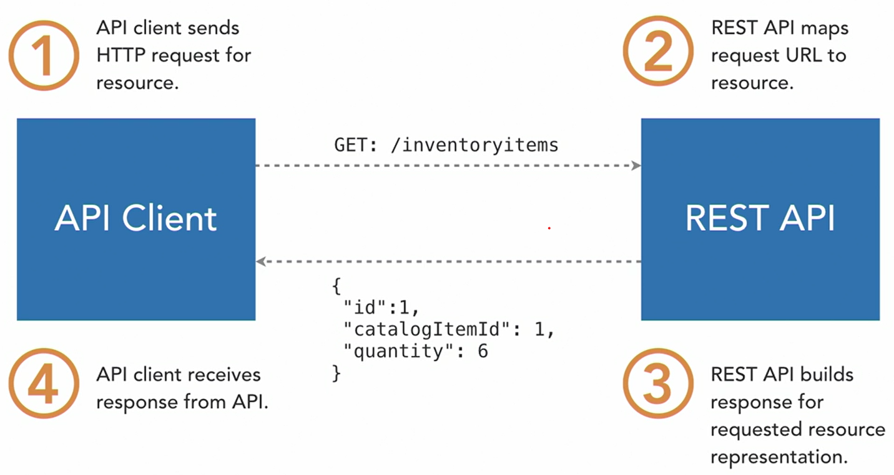
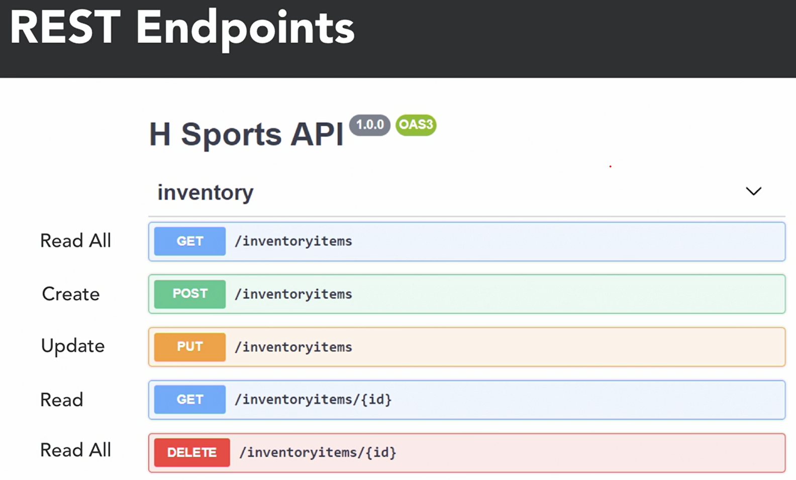

<div align="center">
     </img> 
    
<!-- Encabezado -->
### Java EE 8 | Escencial Training
#### OKR Personal Q4 2022
#### Autor 


| Nombre | Identidad | Correo |
|:-------------:| :-----:|:-----:|
| Edgar Josué Benedetto Godoy | `0801-1997-23600` | [Gmail](mailto:edgar.benedetto@baccredomatic.hn) |

</div>

_____
_____
## 9. JAX-RS API
#### 9.1 Vista previa de RESTful Web Services



En la arquitectura REST, los **clientes de API envían solicitudes a una API** y **reciben respuestas a través de HTTP**. La **solicitud HTTP contiene información como el URL y el método de solicitud que informa a la API de una operación** o datos deseados que solicita el cliente. 

La **API asigna información de solicitud a un punto final o endpoint** y luego **devuelve una respuesta al cliente en formato adyacente a través de HTTP**. La respuesta contiene representaciones de recursos para datos solicitados o información sobre la operación realizada como resultado de la solicitud del cliente. Luego, el cliente recibe la respuesta de la API y procesa la información devuelta por la API. 



Esta **API REST proporciona puntos finales o endpoints** que corresponden a las operaciones de un recurso de elementos de inventario. Expone cinco puntos finales para el recurso que generalmente se asignan a **operaciones CRUD**. **A la izquierda** de los puntos finales o **endpoints**, están los **métodos u operaciones de solicitud** y sus asignaciones correspondientes a las **operaciones CRUD**. Algunas operaciones, como la publicación, requieren que los clientes de la API proporcionen información adicional en el cuerpo de la solicitud HTTP, como el elemento de inventario que se va a crear. Por lo general, esto se proporciona en un formato adyacente. Otros puntos finales o endpoints pueden requerir que se proporcione información en la URL, que **se indica mediante los parámetros de la plantilla entre llaves**.

_____
#### 9.2 Vista previa de Java API for RESTful Web Services JAX-RS

La API de Java para servicios web RESTful o JAX-RS proporciona una API para el desarrollo de servicios web creados con el estilo de arquitectura REST. Los desarrolladores de Java EE pueden usar **JAX-RS para simplificar el desarrollo de servicios basados ​​en REST utilizando un enfoque centrado en POJO, anotaciones y el protocolo HTTP**. La API JAX-RS permite a los desarrolladores crear POJO simples que se anotan para respaldar la construcción de una API REST. 

Las **anotaciones se aplican principalmente a clases conocidas como recursos** y sus métodos conocidos como métodos de recursos. Estas clases **proporcionan una implementación para los puntos finales o endpoints y los recursos de la API REST** que se encuentran en el diseño de una API. Las anotaciones JAX-RS se asignan a partes de la solicitud HTTP, lo que brinda a los desarrolladores un fácil acceso a los datos enviados en la solicitud. Esto **elimina la necesidad de analizar una solicitud HTTP**. La mayoría de las **implementaciones de JAX-RS se basan en la API de servlet**. Sin embargo, **abstraen las solicitudes de nivel inferior** y el código de procesamiento de respuesta necesario para trabajar con servlets. 

¿Cómo funciona? Usando la anotación ```@ApplicationPath```, establecemos el URL base para endpoints o rutas de recursos en la API. Esto configura la ruta base para la API como /hsports/api. 

##### Aplication
```java
@ApplicationPath("/hsports/api")
public class HsportsApplication extends Application {
}
```

##### HTTP Request
```http
URL: /hsports/api
```

Las API REST de JAX-RS contienen **recursos** que corresponden a objetos dentro de nuestro dominio que están expuestos a través de endpoints de API. Para crear un recurso, **se agrega la anotación de ruta** en el nivel de clase en un POJO de Java **para crear un endpoint para acceder a ese recurso**. La **anotación de ruta** en realidad **se concatena con el URL base que especificamos** mediante la anotación **ApplicationPath**. 

##### Resource
```java
@Path("/inventoryitems")
@Produces("application/json")
@Consumes("application/json")
public class InventoryItemResource {

	@GET
	public String getItem() {
		return "{\"name\":\"Sneakers\"}";
	}
}
```

##### HTTP Request
```http
URL: /hsports/api/inventoryitems
Method: GET
Accept: application/json
Content-Type: application/json
```

Dentro de la clase de recursos, creamos métodos de recursos para manejar las llamadas HTTP entrantes a la API. Cuando JAX-RS selecciona el método de recurso apropiado para manejar una solicitud HTTP, utiliza estas anotaciones de asignación para determinar qué método invocar. La anotación GET en nuestro método de recursos getItem afecta esta selección. Indica que el método getItem solo manejará solicitudes HTTP GET, por lo que si recibimos un HTTP POST, este método no se invocaría. Las **anotaciones Produce y Consumes** también **afectan la forma en que se selecciona un método de recurso**. Se produce una coincidencia cuando recibimos la solicitud en función de los tipos de medios proporcionados o consumidos por un método de recurso. Estos se asignan a los encabezados Accepts y Content-Type en la solicitud. 

Al crear recursos, podemos **aplicar la anotación Path en el nivel del método de recurso para construir nuevos puntos finales o endpoints** dentro de la clase de recurso. Además, las **anotaciones Produces y Consumes se pueden aplicar a nivel de recursos para un control más granular de nuestras asignaciones de solicitudes**. 

##### Mapping Resources
```java
@Path("/inventoryitems")
public class InventoryItemResource {

	@GET
	@Path("item")
	@Produces("application/json")
	@Consumes("application/json")
	public String getItem() {
		return "{\"name\":\"Sneakers\"}";
	}
}
```

##### HTTP Request
```http
URL: /hsports/api/inventoryitems/item
Method: GET
Accept: application/json
Content-Type: application/json
```


La API JAX-RS contiene **anotaciones adicionales** que nos permiten mapear casi todas las partes de la solicitud, incluidos los parámetros de ruta, los parámetros de consulta, las cookies y los encabezados de la solicitud HTTP. 

| Scope | Duration |
| --- | --- |
| @PathParam | Extrae un valor de la ruta o URL de la solicitud HTTP |
| @QueryParam | Extrae un valor de la consulta de la solicitud HTTP |
| @CookieParam | Extrae un valor de la cookie de la solicitud HTTP |
| @HeaderParam | Extrae un valor del encabezado de la solicitud HTTP |
| @MatrixParam | Extrae un valor de la matriz de la solicitud HTTP |
| @FormParam | Extrae un valor del formulario de la solicitud HTTP |
| @Context | Extrae un objeto de contexto de la solicitud HTTP |

Otra gran característica de JAX-RS es su **compatibilidad con la serialización personalizada** para el tipo de medio designado para objetos personalizados. Este ejemplo devuelve un POJO personalizado del método de recursos que JAX-RS serializa a nuestro tipo de medio JSON definido. Entonces, JAX-RS puede manejar la conversión de un objeto Java a un formato de respuesta como JSON sin ningún código por parte del desarrollador. 

##### Serialization Support
```java
@Path("/inventoryitems")
public class InventoryItemResource {

	@GET
	@Path("item")
	@Produces("application/json")
	@Consumes("application/json")
	public InventoryItem getItem() {
		return new InventoryItem("Sneakers");
	}
}
```

##### HTTP Request
```http
URL: /hsports/api/inventoryitems/item
Method: GET
```	

##### HTTP Response
```http
Body: {"name":"Sneakers"}
```

Por el contrario, **JAX-RS admite la deserialización de JSON a tipos de objetos personalizados**. Este ejemplo deserializa el JSON en el cuerpo de la solicitud a un tipo de elemento personalizado especificado como un parámetro en el método de recursos. Estas características hacen que JAX-RS sea una excelente opción para los desarrolladores de Java EE que diseñan sus aplicaciones utilizando API REST.

##### Deserialization Support
```java
@Path("/inventoryitems")
public class InventoryItemResource {

	@POST
	@Path("item")
	@Produces("application/json")
	@Consumes("application/json")
	public InventoryItem createItem(InventoryItem item) {
		return item;
	}
}
```

##### HTTP Request
```http
URL: /hsports/api/inventoryitems/item
Method: POST
Body: {"name":"Sneakers"}
```

_____
#### 9.3 Configuración del proyecto JAX-RS

Con CNTRL+N escribir proyecto ***Dynamic Web Project*** se proporciona un nombre para el nuevo proyecto. Luego lo que vamos a hacer es agregar una nueva aplicación JAX-RS. Con CNTRL+N buscar ***JAX-RS** se selecciona y se proporciona alguna configuración adicional. Como el paquete para esta nueva clase, el nombre de la clase y el URL base para toda la API. 

```java
package com.hsports.api;

import javax.ws.rs.ApplicationPath;

@ApplicationPath("/hsports/api")
public class HsportsRestApplication extends Application {
}
```

Se puede empaquetar donde se empaqueta todas las aplicaciones, dentro de un EAR, en propiedades del EAR, luego en ***ensamblaje de implementación*** y en agregar, podemos agregar un proyecto de tipo ***JAX-RS***.

_____
#### 9.4 Creando un recurso

1. Hacer clic con el botón derecho en el paquete, y luego ir a nuevo y luego verá el recurso JAX-RS en el primer menú. Se obtiene el diálogo para construir un recurso dentro de Eclipse. 
2. Una de las características importantes es que se puede **seleccionar la entidad de destino**. 
3. Luego podemos proceder a **nombrar el punto final o endpoint**
4. Seleccionar es qué tipos de medios admitirá el endpoint. Si no se va a usar XML se puede eliminar de la lista. 
5. Puede crear stubs para que podamos crear diferentes operaciones CRUD, que se expondrán como endpoints en el recurso. 
6. Se podría construir una aplicación JAX-RS por si aún no se ha creado. 

```java
@RequestScoped
@Path("/inventoryitems")
@Produces("application/json")
@Consumes("application/json")
public class InventoryItemEndpoint {

	@POST
	public Response create(final InventoryItem inventoryitem) {
		//TODO: process the given inventoryitem 
		//you may want to use the following return statement, assuming that InventoryItem#getId() or a similar method 
		//would provide the identifier to retrieve the created InventoryItem resource:
		//return Response.created(UriBuilder.fromResource(InventoryItemEndpoint.class).path(String.valueOf(inventoryitem.getId())).build()).build();
		return Response.created(null).build();
	}

	@GET
	@Path("/{id:[0-9][0-9]*}")
	public Response findById(@PathParam("id") final Long id) {

		InventoryItem inventoryitem = new InventoryItem(1L, 1L, "Mittens", 100L); 
		if (inventoryitem == null) {
			return Response.status(Status.NOT_FOUND).build();
		}
		return Response.ok(inventoryitem).build();
	}

	@GET
	public List<InventoryItem> listAll(@QueryParam("start") final Integer startPosition,
			@QueryParam("max") final Integer maxResult) {
		//TODO: retrieve the inventoryitems 
		final List<InventoryItem> inventoryitems = null;
		return inventoryitems;
	}

	@PUT
	@Path("/{id:[0-9][0-9]*}")
	public Response update(@PathParam("id") Long id, final InventoryItem inventoryitem) {
		//TODO: process the given inventoryitem 
		return Response.noContent().build();
	}

	@DELETE
	@Path("/{id:[0-9][0-9]*}")
	public Response deleteById(@PathParam("id") final Long id) {
		//TODO: process the inventoryitem matching by the given id 
		return Response.noContent().build();
	}

}
```

_____
#### 9.5 Publicaciones o Posts de clientes de JAX-RS

Dentro de JAX-RS hay una **API de cliente fluida que podemos usar para realizar llamadas contra una API tranquila**. Cuando usamos el **cliente**, lo vemos como un **consumidor de la API**, por lo que somos un individuo que está interesado en **hacer una llamada a esa API** para obtener algunos datos o realizar alguna operación.  

Se puede agregar persistencia de datos con las anotaciones JPA.

```java
@RequestScoped
@Path("/inventoryitems")
@Produces("application/json")
@Consumes("application/json")
public class InventoryItemEndpoint {

	@PersistenceContext
	private EntityManager entityManager;

	@Transactional
	@POST
	public Response create(final InventoryItem inventoryitem) {
		
		this.entityManager.persist(inventoryitem);
		return Response.created(UriBuilder.fromResource(InventoryItemEndpoint.class).path(String.valueOf(inventoryitem.getInventoryItemId())).build()).build();
	}

	@GET
	@Path("/{id:[0-9][0-9]*}")
	public Response findById(@PathParam("id") final Long id) {

		InventoryItem inventoryitem = this.entityManager.find(InventoryItem.class, id);

		if (inventoryitem == null) {
			return Response.status(Status.NOT_FOUND).build();
		}
		
		inventoryitem.setQuantity(ThreadLocalRandom.current().nextLong(1,100));
		return Response.ok(inventoryitem).build();
	}

	@GET
	@Path("/catalog")
	public InventoryItem findByCatalogId(@NotNull @QueryParam("catalogItemId") Long catalogItemId) {
		
		TypedQuery<InventoryItem> query = this.entityManager
				.createQuery("select i from InventoryItem i where i.catalogItemId = :catalogItemId", InventoryItem.class)
				.setParameter("catalogItemId", catalogItemId);
		
		InventoryItem item = query.getSingleResult();
		item.setQuantity(ThreadLocalRandom.current().nextLong(1,100));
	
		return item; 
	}

	@GET
	public List<InventoryItem> listAll(@QueryParam("start") final Integer startPosition, @QueryParam("max") final Integer maxResult) {
		TypedQuery<InventoryItem> query = this.entityManager.createQuery("select i from InventoryItem i", InventoryItem.class);
		final List<InventoryItem> inventoryitems = query.getResultList(); 
		return inventoryitems;
	}

	@Transactional
	@PUT
	@Path("/{id:[0-9][0-9]*}")
	public Response update(@PathParam("id") Long id, final InventoryItem inventoryitem) {
		this.entityManager.merge(inventoryitem);
		return Response.noContent().build();
	}

	@Transactional
	@DELETE
	@Path("/{id:[0-9][0-9]*}")
	public Response deleteById(@PathParam("id") final Long id) {
		this.entityManager.remove(this.entityManager.find(InventoryItem.class,id));
		return Response.noContent().build();
	}

}
```

Hacer es usar el cliente JAX-RS para realizar una llamada contra el recurso de elementos de inventario en nuestra API JAX-RS, para **obtener un cliente JAX-RS**, podemos usar un **objeto de creación de clientes**. Y tiene un **método** de fábrica llamado .```ClientBuilder.newClient();``` 

Lo siguiente en lo que debemos pensar es ***¿a dónde queremos enviar nuestro tráfico HTTP?*** Así que vamos a construir **una URL de API**. Y esta será básicamente la **URL base de nuestra API**. Una vez tenemos nuestro el endpoint en una variable, o al menos la base, luego lo que hacemos con el cliente es **establecer un objetivo** proporcionando esa URL como el objetivo base al que vamos a acceder. se puede extender aún más esa URL al agregarle una ruta. Se debe apuntar aquí al recurso de artículos de inventario. Entonces, al usar el método de ruta, se concatenará a nuestra URL de API, luego construimos la solicitud e indicamos que será una publicación o post y la publicación necesita que proporcionemos una entidad, se debe usar el objeto de entidad, que tiene un método JSON estático. Y lo que esto nos permite hacer es pasar un objeto y simplemente lo serializará en JSON. Podemos comenzar a usar nuestro nuevo constructor de artículos de inventario. Y el **primer argumento va a ser nulo porque ahora dependemos de nuestro proveedor JPA para generar nuestra clave sustituta**. El segundo parametro será nuestro ID de artículo de catálogo, luego el nombre y luego la cantidad. 

Ahora que la API de REST devolverá una respuesta y podemos asignarla a un objeto de respuesta. Solo tenga cuidado al seleccionar el tipo de respuesta que elige el tipo JAX-RS. Registraremos parte de la información que obtengamos de la respuesta. Allí obtenemos el código de estado. Obtener una ubicación que se devuelva. Y esa ubicación tiene una ruta que apunta a nuestro recurso recién creado. 

```java
@ApplicationScoped
@RemoteService
public class RemoteInventoryService implements InventoryService {

	private String apiUrl = "http://localhost:8080/hsports-catalog-jax/hsports/api/";

	@Override
	public void createItem(Long catalogItemId, String name) {
		
		Client client = ClientBuilder.newClient();
		Response response = client.target(apiUrl)
			.path("inventoryitems")
			.request()
			.post(Entity.json(new InventoryItem(null, catalogItemId, name, (long) new Random().nextInt(10))));
		
		System.out.println(response.getStatus());
		System.out.println(response.getLocation().getPath());
	}
	...
}
```

_____
#### 9.6 Obtenciones o Gets de clientes de JAX-RS

Hay dos formas de hacer una llamada GET, una es usar el método GET y la otra es usar el método GET y pasarle un parámetro de tipo genérico. 

En una facelet de JSF 

```html
<div>
	<h3>Item Details</h3>
	<div>
		<h:outputLabel value="Name:"></h:outputLabel>
		<h:outputLabel value="#{catalogItemDetailBean.item.name}" />
	</div>
	<div>
		<h:outputLabel value="Manufacturer:"></h:outputLabel>
		<h:outputLabel value="#{catalogItemDetailBean.item.manufacturer}" />
	</div>
	<div>
		<h:outputLabel value="Quantity:"></h:outputLabel>
		<h:outputLabel value="#{catalogItemDetailBean.quantity}" />
	</div>
	<div>
		<h:outputLabel value="Available Date:"></h:outputLabel>
		<h:outputLabel value="#{catalogItemDetailBean.item.availableDate}">
			<f:convertDateTime type="localDate" pattern="dd-MM-yyyy" />
		</h:outputLabel>
	</div>
</div>
```

Que use un bean de respaldo 

```java
@Named
@ConversationScoped
public class CatalogItemDetailBean implements Serializable {
	
	private long itemId;

	private CatalogItem item;
	
	private Long quantity;

	@Inject
	@RemoteService
	private InventoryService inventoryService;
	
	@Inject
	private Conversation conversation;
	
	@Inject
	private CatalogLocal catalogBean;
	
	private ItemManager manager = new ItemManager();

	public void fetchItem() {
		this.item = this.catalogBean.findItem(this.itemId);
		this.quantity = this.inventoryService.getQuantity(this.itemId);
	}
	
	public void addManager() {
		this.manager.getCatalogItems().add(this.item);
		this.item.getItemManagers().add(this.manager);
		
		this.catalogBean.saveItem(item);
		this.item = this.catalogBean.findItem(itemId);
	}

	// getters and setters
}
```
Para recuperar lo mostrado en el facelet, se llama al metodo ***fetchItem()*** el cual usa el metodo ***getQuantity()*** del servicio remoto. En el servicio de inventario remoto se debe implementar el método GET, la forma en que se crea la implementación es llamando al API REST de JAX-RX

```java	
@ApplicationScoped
@RemoteService
public class RemoteInventoryService implements InventoryService {

	private String apiUrl = "http://localhost:8080/hsports-catalog-jax/hsports/api/";

	@Override
	public void createItem(Long catalogItemId, String name) {
		
		Client client = ClientBuilder.newClient();
		Response response = client.target(apiUrl)
			.path("inventoryitems")
			.request()
			.post(Entity.json(new InventoryItem(null, catalogItemId, name, (long) new Random().nextInt(10))));
		
		System.out.println(response.getStatus());
		System.out.println(response.getLocation().getPath());
	}
	
	@Override
	public Long getQuantity(Long catalogItemId) {
		Client client = ClientBuilder.newClient();
		InventoryItem inventoryItem = client.target(apiUrl).path("inventoryitems").path("catalog")
			.queryParam("catalogItemId", catalogItemId.toString())
			.request().get(InventoryItem.class);
		return inventoryItem.getQuantity();
	}
}
```

El método ***getQuantity()*** usa el método ***get()*** de JAX-RS, el cual recibe como parámetro un tipo genérico, en este caso es ***InventoryItem.class***.

Obtener nos permite proporcionar un argumento de clase de tipo que escribirá la respuesta que regresa, de modo que cuando hagamos esta llamada a la API REST, devolverá a JSON que representa el elemento del inventario, y podrá deserializarse al clase que proporcionamos.

_____
#### 9.7 Parámetros de plantilla URI

Un **URI** (Identificador Uniforme de Recursos de sus siglas en inglés: **Uniform Resource Identifier**) es una cadena que se refiere a un recurso. Los **más comunes son URLs**, que identifican el recurso dando su ubicación en la Web.

Los parámetros de la plantilla URI dentro de JAX-RS. 

1. Agregarlos a un método de recursos 
	- Inicialmente en el endpoint de la API REST se usa el patron de consulta (sin parámetros de plantilla URI)
	```java
	@GET
	@Path("/catalog")
	public InventoryItem findByCatalogId(@NotNull @QueryParam("catalogItemId") Long catalogItemId) {
		
		TypedQuery<InventoryItem> query = this.entityManager
				.createQuery("select i from InventoryItem i where i.catalogItemId = :catalogItemId", InventoryItem.class)
				.setParameter("catalogItemId", catalogItemId);
		
		InventoryItem item = query.getSingleResult();
		item.setQuantity(ThreadLocalRandom.current().nextLong(1,100));
	
		return item; 
	}
	```
	- Se cambia el método para que use parámetros de plantilla URI, cambiar el parámetro de consulta con un parámetro de ruta y esto es muy típico dentro de las API REST que puede construir o usar
	```java
	@GET
	@Path("/catalog/{catalogItemId}")
	public InventoryItem findByCatalogId(@NotNull @PathParam("catalogItemId") Long catalogItemId) {
		
		TypedQuery<InventoryItem> query = this.entityManager
				.createQuery("select i from InventoryItem i where i.catalogItemId = :catalogItemId", InventoryItem.class)
				.setParameter("catalogItemId", catalogItemId);
		
		InventoryItem item = query.getSingleResult();
		item.setQuantity(ThreadLocalRandom.current().nextLong(1,100));
	
		return item; 
	}
	```
	2. Usarlos en un cliente JAX-RS (servicio remoto)
	- En el servicio remoto se debe cambiar el método ***getQuantity()*** para que use parámetros de plantilla URI, en lugar de usar el método de consulta ***queryParam()***, se cambia eso para resolver la plantilla (***resolveTemplate()***) y eso hará que el parámetro URI de la plantilla reciba el valor del campo de ID del elemento del catálogo y también modificar la ruta.
	```java
	@Override
	public Long getQuantity(Long catalogItemId) {
		Client client = ClientBuilder.newClient();
		InventoryItem inventoryItem = client.target(apiUrl).path("inventoryitems").path("catalog")
				.path("{catalogItemId}")
			.resolveTemplate("catalogItemId", catalogItemId.toString())
			.request().get(InventoryItem.class);
		return inventoryItem.getQuantity();
	}
	```
	3. Ahora el cliente JAX-RS (servicio remoto) está configurado para llamar al nuevo extremo de API que usa el parámetro de plantilla de URI.

_____
#### 9.8 Parámetros de plantilla URI

**JAX-RS 2.0** introdujo la capacidad de **hacer que un método de recursos sea asincrónico**, lo que permite a los desarrolladores utilizar mejor los recursos costosos, como los subprocesos en un servidor. 

Un **método de recurso típico mantendrá un hilo hasta que se devuelva una respuesta al cliente.** Al usar ***async***, podemos liberar subprocesos para realizar el procesamiento mientras esperamos operaciones de ejecución prolongada. 

En el endpoint se puede crear una búsqueda asíncrona por ID, y luego los métodos asíncronos no devuelven nada. En el metodo asincrono no deben de haber etiquetas JAX-RS. Para indicarle a JAX-RS que nos gustaría que un método fuera asíncrono, se necesita agregar la anotación ***@Suspended*** dentro de los parametros del método que llama al metodo asincrono y luego se agrega un nuevo objeto de tipo respuesta asíncrona a la lista de parámetros del método. 

1. Crear un hilo y debe comenzar ese hilo inmediatamente.
2. Dentro del subproceso
   1. Crear un método llamado ***run()*** que devuelva un tipo nulo 
   2. Dentro del metodo ***run()** se puede suspender el subproceso durante por ejemplo 5000 milisegundos, solo para indicar un llamada de larga duración. 
   3. Dentro del cuerpo del método ***run()*** se llama método de reanudación, esto le indica a JAX-RS que el método de recursos asincrónicos tiene una respuesta para devolver. En este caso, eso es algún punto en el futuro, 5000 milisegundos. 

```java
@GET
	@Path("/catalog/{catalogItemId}")
	public void asyncFindByCatalogId(@NotNull @PathParam("catalogItemId") Long catalogItemId,
			@Suspended AsyncResponse ar) {
		
		new Thread() {
			public void run() {
				try {
					Thread.sleep(5000);
				} catch (InterruptedException e) {
					// TODO Auto-generated catch block
					e.printStackTrace();
				}
				
				ar.resume(findByCatalogId(catalogItemId));
			}
		}.start();
		
	}

	public InventoryItem findByCatalogId(@NotNull @PathParam("catalogItemId") Long catalogItemId) {
		
		TypedQuery<InventoryItem> query = this.entityManager
				.createQuery("select i from InventoryItem i where i.catalogItemId = :catalogItemId", InventoryItem.class)
				.setParameter("catalogItemId", catalogItemId);
		
		InventoryItem item = query.getSingleResult();
		item.setQuantity(ThreadLocalRandom.current().nextLong(1,100));
	
		return item; 
	}
```

**¿Cómo se realiza el llamado de el método asincrono desde el cliente JAX-RS?** 
Se agrega un método en nuestra interfaz de servicio, permitirá recuperar un artículo de inventario de tipo futuro, con eso ya se hace la llamada y luego, en algún momento se obtiene la respuesta.

```java
public interface InventoryService extends Serializable {

	public void createItem(Long catalogItemId, String name);
	
	public Long getQuantity(Long catalogItemId);
	
	public Future<InventoryItem> asyncGetQuantity(Long catalogItemId);
}
```

En el servicio remoto se debe desarrollar la llamada al método de recursos asincrónicos en la API. Así que ahora estamos viendo esto desde la perspectiva del cliente, por lo que alguien llama a la API y el cliente JAX-RS también nos permite realizar llamadas de forma asíncrona. 

Ppara hacer una llamada asíncrona, solo agregamos el método ***async()*** entre la solicitud y los métodos de obtención. Ahora se recupera un futuro que dirá en algún momento más adelante, obtendrás la respuesta, simplemente no será ahora. 

```java	
@ApplicationScoped
@RemoteService
public class RemoteInventoryService implements InventoryService {

	private String apiUrl = "http://localhost:8080/hsports-catalog-jax/hsports/api/";

	@Override
	public Future<InventoryItem> asyncGetQuantity(Long catalogItemId) {

		Client client = ClientBuilder.newClient();
		return client.target(apiUrl).path("inventoryitems").path("catalog")
				.path("{catalogItemId}")
			.resolveTemplate("catalogItemId", catalogItemId.toString())
			.request().async().get(InventoryItem.class);
	}
	...
}
```

Se debe cambiar el bean de respaldo que llama a este método del servidor remoto, este es el bean que se usa para obtener la cantidad de un artículo en particular y lo muestra en la interfaz de usuario. Simplemente se llama a ese futuro, luego se invoca la versión asíncrona de nuestro método y pasaremos el parametro id. Luego se hace la llamada y luego continuar la ejecución dentro del hilo actual. Eventualmente se ocupará bloquear, se debe llamar al método ***get()*** del futuro que hará que la ejecución del hilo se bloquee y podamos recuperar la respuesta esperada. El futuro puede generar una excepción, por lo que debemos agregarla a la cláusula throws del método. 

```java
@Named
@ConversationScoped
public class CatalogItemDetailBean implements Serializable {
	
	private long itemId;

	private CatalogItem item;
	
	private Long quantity;

	@Inject
	@RemoteService
	private InventoryService inventoryService;
	
	@Inject
	private Conversation conversation;
	
	@Inject
	private CatalogLocal catalogBean;
	
	private ItemManager manager = new ItemManager();

	public void fetchItem() throws InterruptedException, ExecutionException {
		this.item = this.catalogBean.findItem(this.itemId);
		
		Future<InventoryItem> future = this.inventoryService.asyncGetQuantity(this.itemId);
		System.out.println("Doing other working");
		
		this.quantity = future.get().getQuantity();
		System.out.println("Completed request");
	}
	
	public void addManager() {
		this.manager.getCatalogItems().add(this.item);
		this.item.getItemManagers().add(this.manager);
		
		this.catalogBean.saveItem(item);
		this.item = this.catalogBean.findItem(itemId);
	}
	...
}
```
_____
#### 9.9 Funciones reactivas

**Las funciones reactivas** son un paradigma de programación que se basa en la idea de que los datos son un flujo de eventos. En lugar de que los datos se almacenen en una estructura de datos, se almacenan en un flujo de eventos.

**¿Qué es un flujo de eventos?**
Un flujo de eventos es una secuencia de eventos que ocurren en el tiempo. Cada evento tiene un valor y un momento en el tiempo en que ocurre. Los eventos se pueden emitir de forma síncrona o asíncrona.

**¿Qué es un flujo de eventos reactivos?**
Un flujo de eventos reactivos es un flujo de eventos que se puede observar. Los observadores pueden suscribirse a un flujo de eventos reactivos para recibir notificaciones cuando se emiten eventos. Los observadores pueden recibir notificaciones de eventos de forma síncrona o asíncrona.

El cliente JAX-RS recibe soporte para el estilo de programación Reactivo que brinda a los desarrolladores una forma más sucinta de manejar llamadas asíncronas. Bajo el enfoque Reactivo, evitamos el uso de devoluciones de llamada y optamos por usar una etapa de finalización que permite que una cadena de etapas se complete de forma asíncrona. Echemos un vistazo al estilo de programación reactivo trabajando con el cliente reactivo JAX-RS. Así que no necesitaremos cambiar nada dentro de nuestro recurso. Vamos a llamar al método de recurso asíncrono que creamos anteriormente, pero si echamos un vistazo a nuestro InventoryService, notará que agregamos un nuevo método, el reactivoGetQuantityMethod y devuelve un objeto de etapa de finalización de tipo que se escribe de forma genérica para especificar InventoryItem como parámetro genérico. La etapa de finalización nos permite encadenar diferentes llamadas de forma asincrónica. Si echa un vistazo a nuestra clase RemoteInventoryService, verá que hemos proporcionado un código auxiliar para el método reactiveGetQuantity. Y es realmente simple hacer una llamada asíncrona. Solo voy a copiar el código que usamos para crear el cliente asíncrono. Y luego voy a pegarlo en el cuerpo de ese método y todo lo que tenemos que hacer es cambiar el método asíncrono con el método rx y nos hemos vuelto Reactivo. Bien, así es como hacemos la llamada Reactiva con el cliente JAX-RS. Ahora, va a cambiar un poco la forma en que manejamos el objeto de retorno de esa llamada, así que vayamos a nuestro bean de respaldo y actualmente estamos usando nuestro método asíncrono, pero necesitamos cambiarlo. Así que hagamos un poco de trabajo aquí y simplemente dejaré la llamada asíncrona allí para que puedan comparar y contrastar y luego lo limpiaremos cuando hayamos terminado. Bien, lo primero que vamos a hacer es crear un CountDownLatch y eso es para que podamos realizar un seguimiento de la cantidad de llamadas que esperamos hacer, así como la cantidad de llamadas que recibimos de vuelta, así que solo vamos para crear un CountDownLatch con el constructor proporcionando un argumento de uno. De acuerdo, lo siguiente que debemos hacer es usar el servicio de inventario y el método reactivo que creamos y pasaremos el ID del artículo para que podamos obtener el artículo del catálogo apropiado y luego notará que comenzamos a encadenar el método llamadas por lo que está el método thenApply y se ejecutará una vez que obtengamos la respuesta de la API y podemos proporcionar una función aquí que se ejecutará una vez que obtengamos esa respuesta, por lo que nos devolverá el elemento de inventario y luego lo que Lo que vamos a hacer es obtener la cantidad de ese artículo y luego seguiremos adelante y haremos esto en una línea separada para que sea fácil de leer. Entonces vamos a seguir adelante y encadenar otra llamada aquí. Así que vamos a decir luego Aceptar y eso indica que es nuestra última llamada y luego proporcionamos otro método, así que obtuvimos la cantidad y la pasamos al siguiente método donde continuaremos y estableceremos la cantidad. en nuestro bean de respaldo y podemos pasar la cantidad e imprimirla para poder verla en la consola. Obtendremos la cantidad del bean de respaldo. Y ahora llamamos a nuestro pestillo y le decimos que haga una cuenta regresiva. Y finalmente, solo agregamos nuestro punto y coma y, a partir de ahí, agregaré un poco más de depuración. Mantendremos algo de esto, así que eliminemos nuestras llamadas asincrónicas ya que vamos a Reactivo aquí. Y lo que haremos es mantener la solicitud completa y finalmente tenemos que esperar en la llamada de pestillo en la parte inferior de nuestro método para que espere a escuchar la cuenta regresiva. Bien, este es un ejemplo del uso de la etapa de finalización y la forma en que podemos encadenar diferentes llamadas cuando recibimos una respuesta de una API. Sigamos adelante y podemos ejecutar este ejemplo. Así que allí se inició nuestra aplicación. Comenzaré a abrir un navegador y luego regresaremos a nuestra consola aquí. Déjame aclararlo. Y luego nos pondremos a trabajar aquí creando un producto. Allí se creó el producto y luego vamos a seguir adelante y acceder a los detalles. Una vez más, aquí estamos bloqueando, pero notó que completó la solicitud y luego regresó y obtuvimos nuestra cantidad. Bien, ese fue un ejemplo del estilo de programación reactivo que ahora es compatible con JAX-RS.